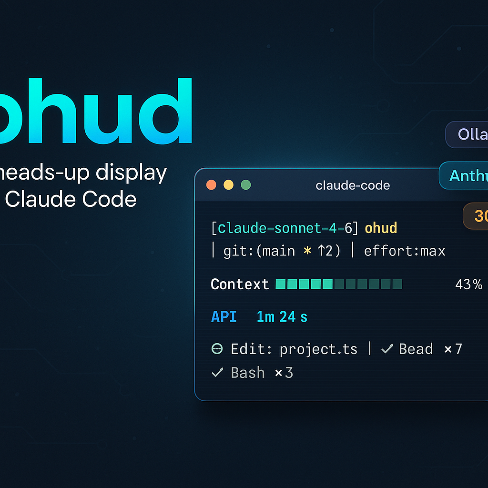
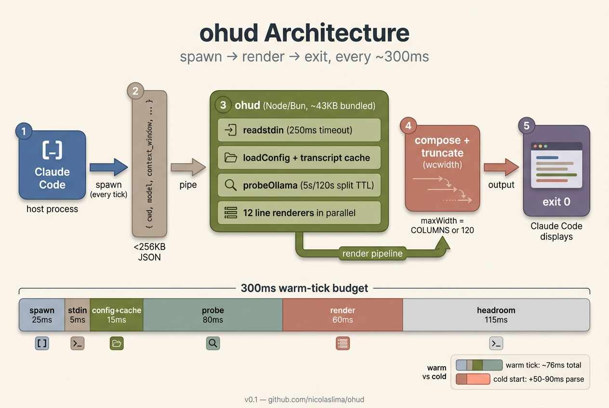

<p align="center">
  
</p>

<h1 align="center">ohud</h1>

<p align="center">
  <strong>A heads-up display for Claude Code.</strong><br/>
  Real-time statusline with Ollama Cloud + Anthropic dual-mode rendering, in ~76ms per tick.
</p>

<p align="center">
  <a href="LICENSE"></a>
  
  
  
  
</p>

---

## ⚡ 60-second install

```
/plugin marketplace add nicolaslima/ohud-plugins
/plugin install ohud
```

Restart Claude Code. The HUD appears below every assistant message. Done.

> **Optional:** `/ohud configure` to pick a preset (Full / Essential / Minimal).
> **Optional:** `/ohud doctor` if anything looks off.

## 👀 What it looks like

```
[glm-5:cloud ⚡ 1T] │ ohud │ git:(main *↑3 ↓1) │ effort:max
Context ████░░░░░░ 43% │ API ⏱ 4m 12s
◐ Edit: project.ts │ ✓ Read ×42 │ ✓ Bash ×17
▸ implement split-TTL cache (3/9)
RAM ███████░░░ 71% (11.4 GB / 16.0 GB)
```

Five lines, each reading from the JSON Claude Code pipes via stdin, the session transcript JSONL, an optional Ollama probe, and your git working copy. Lines you don't want hide via flags — turn off `showMemoryUsage` and that bottom line vanishes.

## 🎯 Two modes, auto-detected

| Mode | Trigger | Lines unlocked |
|---|---|---|
| **Ollama** | `model.id` ends in `:cloud` OR matches a model from your local Ollama daemon at `localhost:11434` | `[name ⚡ 1T]` badge with parameter size, `API ⏱ Xm Ys` consumption |
| **Anthropic** | anything else (default fallback) | `Usage 5h/7d` rate-limit windows, `Cost $X.YZ` (estimate or native), `cache N%` prompt-cache freshness |

Common to both: project path + git, context bar, tools/agents/todos, environment counts, memory, duration, effort level.

Detection happens silently — no warnings, no flags to set. Wrong mode? `/ohud doctor` shows what got resolved and why.

## 🏗 How it works

<p align="center">
  
</p>

Spawn-per-tick. Every ~300ms during an active session, Claude Code spawns `dist/index.js`, pipes a JSON blob to stdin, ohud reads it + the transcript + an Ollama probe (split-TTL cached: 5s daemon, 120s models), runs 12 line renderers in parallel, writes to stdout, exits. No daemon, no in-memory state across ticks, no cleanup logic.

Watch the lifecycle animated: see [`docs/_assets/spawn-per-tick.svg`](docs/_assets/spawn-per-tick.svg) (loops every 6s on GitHub).

## 📊 Performance

<p align="center">
  
</p>

Median tick: **76.9ms** — 25.6% of the 300ms budget. Cold-start measured with `OHUD_PROFILE=1` on Node 22 / M1 macOS. ohud is monomorphic on the hot path (no try/catch in render loop, no allocations in the inner per-line code), and the Ollama probe uses a split-TTL cache that almost always hits. Full breakdown: [`docs/explanation/300ms-budget.md`](docs/explanation/300ms-budget.md).

## 📚 Documentation

Documentation follows the [Diátaxis](https://diataxis.fr/) methodology — pick the section that matches what you need *right now*:

| Need | Section |
|---|---|
| 🟢 Just installed, walk me through it | [Tutorial: Getting Started](docs/tutorials/getting-started.md) |
| 🛠 I have a specific problem | [How-To Guides](docs/how-to/) (5 recipes) |
| 📚 What does flag X do? | [Reference](docs/reference/) (config, env vars, stdin, line modules, slash commands) |
| 💡 Why is it shaped this way? | [Explanation](docs/explanation/) (architecture, design decisions, 300ms budget) |

Full index: [`docs/README.md`](docs/README.md).

### Quick links

- **Configuration**: [docs/reference/config-schema.md](docs/reference/config-schema.md)
- **Slash commands**: [docs/reference/slash-commands.md](docs/reference/slash-commands.md)
- **All 12 line modules**: [docs/reference/line-modules.md](docs/reference/line-modules.md)
- **Customize colors**: [docs/how-to/customize-colors-and-glyphs.md](docs/how-to/customize-colors-and-glyphs.md)
- **Diagnose problems**: [docs/how-to/diagnose-blank-statusline.md](docs/how-to/diagnose-blank-statusline.md)

## 🚦 Requirements

| Item | Minimum | Recommended |
|---|---|---|
| Claude Code | any recent version | latest |
| Runtime | Node.js ≥18 | Bun |
| Ollama (optional) | any version | `ollama serve` running on `localhost:11434` |
| Terminal | ANSI 16-color | truecolor + UTF-8 |

ohud has **zero runtime dependencies** — only Node/Bun stdlib + `fetch` + `AbortController`. Bundle is one ~43KB JS file in `dist/`. See [zero-deps rationale](docs/explanation/design-decisions.md#zero-runtime-dependencies).

## 🩺 Troubleshooting

Statusline blank? Wrong mode showing? Always start with:

```
/ohud doctor
```

It prints version, runtime, resolved bundle path, live probe state, current mode, and which config flags are actually consumed (vs `DEAD FLAG` placeholders). Plus the last 5 errors from `~/.claude/plugins/ohud/last-errors.log`.

Then jump to [docs/how-to/diagnose-blank-statusline.md](docs/how-to/diagnose-blank-statusline.md) — a flowchart for the most common failure modes.

## 🔧 Development

```bash
git clone https://github.com/nicolaslima/ohud
cd ohud
bun install
bun test          # 103 tests
bun run build     # rebuild dist/index.js
```

`dist/` is **committed** intentionally — marketplace install is `git clone` with no postinstall. CI guards drift via `bun run build && git diff --exit-code dist/`. See [why dist/ is committed](docs/explanation/design-decisions.md#why-dist-is-committed-to-git).

To add a 13th line renderer, follow the recipe at [docs/how-to/add-a-new-line-module.md](docs/how-to/add-a-new-line-module.md).

## 🙏 Inspiration

Visual layout inspired by [`claude-hud`](https://github.com/jarrodwatts/claude-hud) by Jarrod Watts. ohud is an independent reimplementation, not a fork — different goals (stateless spawn-per-tick, dual-mode auto-detection, zero deps).

## 📜 License

MIT. See [LICENSE](LICENSE).
