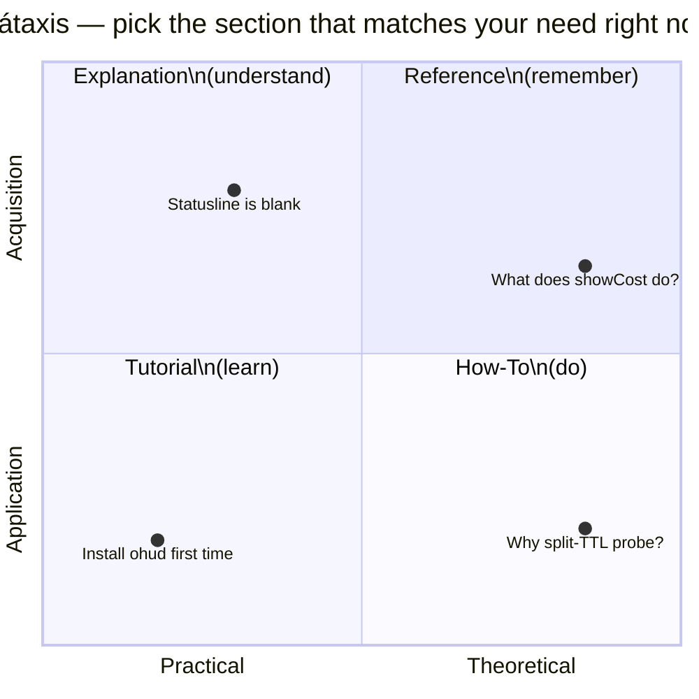

  

# ohud Documentation

Real-time statusline HUD for Claude Code with Ollama Cloud + Anthropic dual-mode rendering.

This documentation follows the **[Diátaxis methodology](https://diataxis.fr/)** — four sections, each serving a different reader need:

---

## 🟢 Tutorials — *I'm new and want to learn*

Step-by-step walkthroughs that hold your hand from zero to working state. Read these first if you've never used ohud.

- **[Getting started: install to first render](tutorials/getting-started.md)** — 10 minutes, end-to-end.

## 🛠 How-To Guides — *I have a specific task*

Recipes for common situations. Skim the titles; jump to the one that matches your problem.

- **[Diagnose a blank statusline](how-to/diagnose-blank-statusline.md)** — when ohud renders nothing.
- **[Customize colors and glyphs](how-to/customize-colors-and-glyphs.md)** — make ohud match your terminal theme.
- **[Enable Ollama Cloud mode](how-to/enable-ollama-cloud-mode.md)** — set up `:cloud` model rendering.
- **[Work in restricted terminals](how-to/work-in-restricted-terminals.md)** — `NO_COLOR`, ASCII glyphs, narrow widths.
- **[Add a new line module](how-to/add-a-new-line-module.md)** — developer extension recipe.

## 📚 Reference — *I need exact facts*

Information-oriented. Look things up.

- **[Configuration schema](reference/config-schema.md)** — every `HudConfig` field documented.
- **[Slash commands](reference/slash-commands.md)** — `/ohud setup`, `/ohud configure`, `/ohud doctor`.
- **[Environment variables](reference/environment-variables.md)** — `NO_COLOR`, `OHUD_PROFILE`, `LANG`, etc.
- **[Stdin contract](reference/stdin-contract.md)** — JSON shape ohud expects from Claude Code.
- **[Line modules catalog](reference/line-modules.md)** — all 12 renderers and their outputs.

## 💡 Explanation — *I want to understand the why*

Conceptual deep-dives. Read for grokking, not for tasks.

- **[Architecture overview](explanation/architecture.md)** — system shape, data flow, module boundaries.
- **[Dual-mode detection](explanation/dual-mode-detection.md)** — how Ollama vs Anthropic gets resolved.
- **[Probe cache policy](explanation/probe-cache-policy.md)** — why split-TTL (5s daemon, 120s models).
- **[The 300ms budget](explanation/300ms-budget.md)** — hot path strategy and trade-offs.
- **[Design decisions](explanation/design-decisions.md)** — `${CLAUDE_PLUGIN_ROOT}`, `:cloud` heuristic, zero-deps.

---

## Quick navigation

- **First time?** → [tutorials/getting-started.md](tutorials/getting-started.md)
- **Something broken?** → [how-to/diagnose-blank-statusline.md](how-to/diagnose-blank-statusline.md)
- **Just want to know what a flag does?** → [reference/config-schema.md](reference/config-schema.md)
- **Curious about internals?** → [explanation/architecture.md](explanation/architecture.md)

## Internal/development docs

These are not user-facing — they document the project's evolution:

- [`hypothesis-verification.md`](hypothesis-verification.md) — empirical verification of Ollama timing-field propagation.
- [`cold-start-measurement.md`](cold-start-measurement.md) — measured cold-start cost per tick.
- [`superpowers/specs/`](superpowers/specs/) — design specs.
- [`superpowers/plans/`](superpowers/plans/) — implementation plans.

## A note on visuals

The docs combine three illustration techniques, each chosen for what it does best:

| Technique | Used for | Where |
|---|---|---|
| **Mermaid diagrams** (inline) | Logic flows, decision trees, sequence diagrams. Renders natively on GitHub. Editable as plain text. | Most explanation/how-to/reference pages |
| **Static images** (PNG/JPG) | Hero covers + data-dense infographics. Generated via OpenRouter (`gpt-5-image`, `gemini-3-pro-image-preview`). | `_assets/cover-readme.png`, `architecture-hero.jpg`, `300ms-timeline.jpg`, `tutorial-cover.png` |
| **Animated SVG** | Kinetic concepts (the spawn-per-tick lifecycle). Hand-crafted, pure SVG `<animate>` — works on GitHub markdown. | `_assets/spawn-per-tick.svg` |

If your viewer doesn't render Mermaid, the diagram source is still readable as a flowchart description in plain text. If your viewer doesn't render animated SVG, the static frame still conveys the layout.
