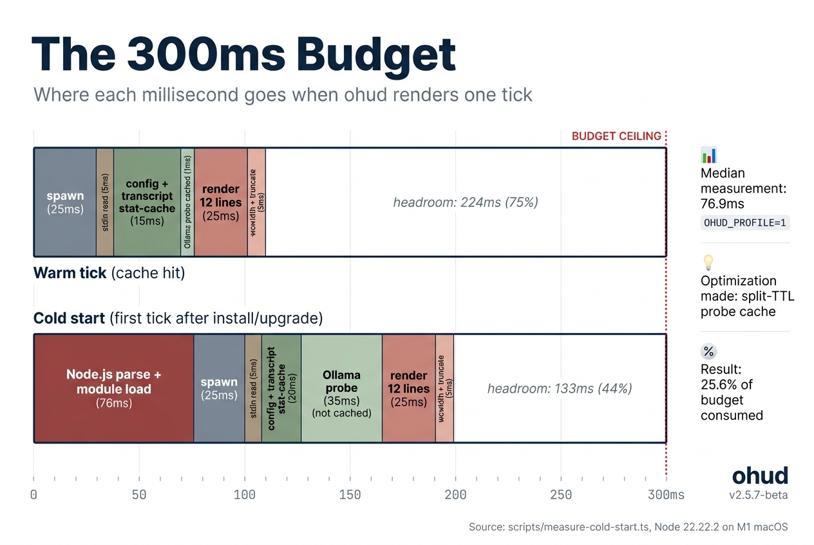
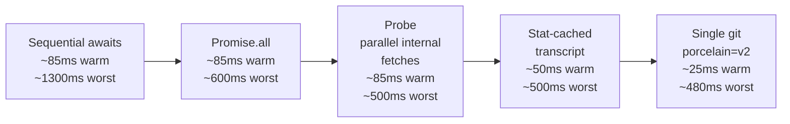

# The 300ms Budget

> **Diátaxis: Explanation.** Why ohud cares about milliseconds and how the optimization sequence stays within budget.

<p align="center">
  
</p>

## Where 300ms comes from

Claude Code's statusline contract calls a configured `command` roughly every 300 ms while a session is active. Each invocation is a **fresh process spawn** — no daemon model, no warm process to reuse.

A statusline that takes longer than the cadence has two visible failure modes:

1. **Visible lag** — the statusline appears stuck on outdated data while the user is typing.
2. **Output piling up** — Claude Code may queue or drop renders if previous ones haven't completed.

The 300 ms window is the practical ceiling. ohud aims for a much tighter steady-state target — under 100 ms — to leave headroom for cold-start variance and worst-case I/O.

## Cold-start cost

Every tick pays the JS runtime startup cost: V8 + Bun bundle eval + module init. Measured (see `docs/cold-start-measurement.md`):

| Metric | Value |
|---|---|
| Min | 73.2 ms |
| Median | 76.9 ms |
| Max | 165.4 ms |

So **~77 ms is gone before user code runs**. That's 25.6% of the 300 ms budget already spent. The remaining ~223 ms must cover: stdin read, config load, probe, transcript, git, mode resolve, render, stdout flush.

## Hot-path breakdown

Steady-state on a typical dev machine, cache warm:

```mermaid
gantt
    title One tick (cache warm) — total ≈ 60 ms
    dateFormat X
    axisFormat %s

    section Setup
    cold-start (V8 + bundle eval) :startup, 0, 77

    section IO (parallel)
    probeOllama (cache hit)        :crit, par1, 77, 1
    parseTranscript (stat hit)     :par2, 77, 1
    getGitStatus (single git exec) :par3, 77, 12

    section Compute
    resolveMode + buildContext     :compute, 89, 2
    render + truncate              :render, 91, 2

    section Output
    stdout write                   :out, 93, 1
```



Worst case (cache miss, hung daemon, large transcript, dirty git):

```mermaid
gantt
    title One tick (cache miss + hung daemon) — total ≈ 600 ms
    dateFormat X
    axisFormat %s

    section Setup
    cold-start                     :77, 0, 77

    section IO (parallel)
    probeOllama (timeout 500ms)    :crit, par1, 77, 500
    parseTranscript (10MB JSONL)   :par2, 77, 80
    getGitStatus (large dirty repo) :par3, 77, 60

    section Compute
    resolveMode + buildContext     :compute, 577, 2
    render + truncate              :render, 579, 2

    section Output
    stdout write                   :out, 581, 1
```



The `Promise.all` is what keeps worst-case under 600 ms instead of 600 + 80 + 60 = 740 ms.

## The optimization sequence

ohud's perf was reached by a deliberate sequence of fixes:



Each arrow is one task from the v0.1 review-driven refactor. Numbers are approximate steady-state means.

## Anti-patterns the budget rules out

**Synchronous `fs` calls on the hot path.** `fs.readFileSync` blocks the event loop. ohud uses `fs.promises` everywhere except the probe cache (where the read is < 1 ms and bundling it into Promise.all would force a full async refactor for negligible gain).

**Heavy npm dependencies.** ohud has zero runtime deps. Adding `string-width` for terminal width math would have added ~30 KB to the bundle, doubling cold-start parse cost (which runs every tick). Instead, `src/render/width.ts` ships an inline minimal `wcwidth` covering only the glyphs ohud actually emits.

**Unbounded I/O.** Every fetch goes through `fetchWithTimeout` (`AbortController` + 500 ms ceiling). Every git call has `timeout: 1000` in its `execFile` options. There is no way for ohud to hang indefinitely on an external resource.

**Per-tick allocations of large objects.** The transcript cache (`src/transcript.ts`) keys on `(path, size, mtimeMs)`. ~95% of ticks hit the stat fast path (~0.1 ms) instead of re-reading and re-parsing the JSONL. For multi-day sessions where transcripts grow to 10 MB, this drops parse cost from 80–120 ms to < 1 ms.

## When to add a perf assertion

`tests/integration.test.ts` includes:

```ts
test("integration: hot path completes under 300ms in steady state", async () => {
  // ...two invocations: first warms cache, second measures
  expect(elapsed).toBeLessThan(300);
});
```

This guards against silent regressions. The most plausible way to break it would be reverting the `Promise.all` in `src/index.ts` to sequential `await`s — the test catches that immediately.

If you add a new line module that does I/O (filesystem read, HTTP call), gate it behind a `display.show*` flag (default off), and consider a per-tick stat cache like transcript's. Otherwise the test will start failing on long sessions.

## Reading the cold-start log

You can reproduce the measurement on your machine:

```bash
cd /path/to/ohud
bun run build
for i in 1 2 3 4 5; do
  echo '{"session_id":"profile-'"$i"'","model":{"id":"glm-5:cloud"},"workspace":{"current_dir":"'"$PWD"'"},"context_window":{"used_percentage":42}}' \
    | OHUD_PROFILE=1 node dist/index.js 2>&1 >/dev/null
done
```

Each run prints `ohud-profile: total=Xms` to stderr. The instrumentation is permanent (zero-cost when env unset), so you can re-run anytime to detect regressions.

## What we deferred

These are real improvements that were judged not-yet-worth-it:

- **Daemon-model architecture** (long-lived process, RPC). Eliminates cold-start (~77 ms recovered) but requires a socket protocol and a supervisor. Out of scope for v0.1; would invalidate the simple "spawn-per-tick" mental model.
- **Bundle minification.** Could shave ~5 ms off cold-start. Trade-off: harder stack traces in error reports.
- **`string-width` for accurate East Asian width math.** ohud's inline wcwidth covers BMP and the specific glyphs it emits. CJK support beyond that is a v0.2 concern.

## Read next

- **[Architecture overview](architecture.md)** — where the budget fits in the overall pipeline.
- **[Probe cache policy](probe-cache-policy.md)** — TTL choices and their perf implications.
- **[reference/environment-variables.md](../reference/environment-variables.md)** — `OHUD_PROFILE` documentation.
