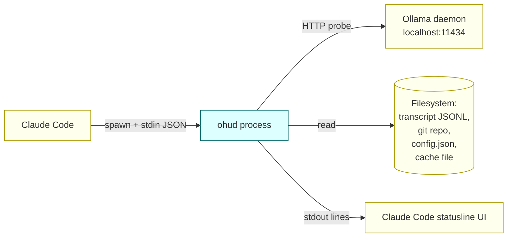
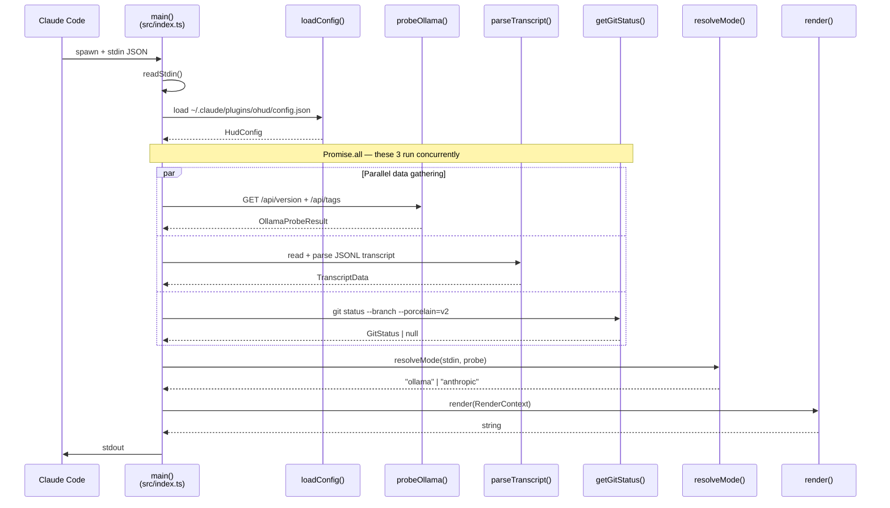
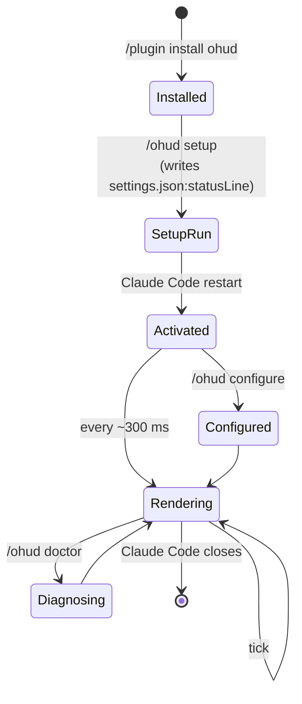

# Architecture Overview

> **Diátaxis: Explanation.** Read this to understand *why* ohud is shaped the way it is. For exact field definitions, jump to [reference/config-schema.md](../reference/config-schema.md). For tasks like "fix a blank statusline", see [how-to/](../how-to/).

<p align="center">
  
</p>

## The lifecycle in motion

The diagram above is a snapshot. Below is the same flow animated — six seconds, looping forever, the way Claude Code actually drives ohud during your session:

<p align="center">
  
</p>

## What ohud is

ohud is a **stateless command-line program** that Claude Code spawns roughly every 300 ms during an active session. On each invocation:

1. Claude Code pipes a small JSON blob to `ohud`'s stdin (session info, model, context window, etc).
2. ohud reads that, gathers a few extra signals (transcript file, git status, optional Ollama probe).
3. ohud writes one or more rendered lines to stdout.
4. Claude Code displays those lines in its statusline UI.
5. The process exits. There is no daemon, no background thread.

This shapes every architectural decision: short-lived process, hot path budget, no in-memory state across ticks.

## High-level data flow



ohud's only outputs are **stdout lines** (which Claude Code displays) and **side-effect file writes** (probe cache in `tmpdir`, error log in `~/.claude/plugins/ohud/`).

## Internal pipeline of one tick



The **`Promise.all` is load-bearing**: each of the three I/O sources (probe, transcript, git) takes 10–80 ms on its own. Running them serial would push the budget past 300 ms in worst cases. Running them in parallel caps wall-clock at `max(probe, transcript, git)` instead of summing.

See [The 300ms budget](300ms-budget.md) for measurements.

## Module map

```
src/
├── index.ts            # Entry point — orchestrates the pipeline above
├── stdin.ts            # Read JSON from stdin with timeouts and max-bytes guard
├── config.ts           # Load + deep-merge user config with DEFAULT_CONFIG
├── ollama-probe.ts     # HTTP probe + split-TTL cache + atomic write
├── mode.ts             # resolveMode() — pure function: stdin + probe → mode
├── transcript.ts       # Parse Claude Code session JSONL with stat-based cache
├── git.ts              # Single porcelain=v2 call → branch + ahead/behind + dirty
├── memory.ts           # os.freemem()/totalmem() — opt-in
├── usage.ts            # 5h/7d windows from stdin or external snapshot
├── cost.ts             # Estimate session cost from token usage
├── effort.ts           # Parse stdin.effort (defensive union)
├── doctor.ts           # /ohud doctor logic
├── types.ts            # All cross-module types (HudConfig, RenderContext, etc.)
└── render/
    ├── index.ts        # Orchestrator — collects Widget cells, dispatches to Layout
    ├── widget.ts       # Widget + WidgetCell + HushCell interfaces
    ├── colors.ts       # ANSI color helper, NO_COLOR/TERM=dumb gating
    ├── dim.ts          # dim(text, env) helper — SGR 2 with NO_COLOR guard
    ├── spinner.ts      # spinnerFrame(now, mode) — pure function, 4-frame cycle
    ├── hyperlink.ts    # link(text, url) — OSC 8 escape, BEL sanitization
    ├── width.ts        # wcwidth + truncateLine for terminal-width clamping
    ├── glyphs.ts       # Unicode/ASCII fallback (LANG-detected)
    ├── widgets/
    │   ├── index.ts        # WIDGETS registry + visibleWidgets(config)
    │   ├── project.ts      # name + branch + model (3 sub-cells in Hush)
    │   ├── context.ts      # Context bar (Row) / % text (Hush)
    │   ├── api-time.ts     # API ⏱ duration (Ollama mode)
    │   ├── usage.ts        # 5h/7d bars (Anthropic mode)
    │   ├── cost.ts         # Session cost (null in Hush)
    │   ├── prompt-cache.ts # Cache TTL remaining
    │   ├── tools.ts        # Tool invocations (spinner cells in Hush)
    │   ├── agents.ts       # Sub-agent activity (spinner cells in Hush)
    │   ├── todos.ts        # In-progress todo
    │   ├── memory.ts       # System RAM (null in Hush)
    │   ├── environment.ts  # CLAUDE.md / settings counts (null in Hush)
    │   └── duration.ts     # Session duration
    └── layout/
        ├── index.ts        # Layout interface + LAYOUTS registry (row | hush)
        ├── row.ts          # RowLayout — full ANSI, bars, pipes
        └── hush.ts         # HushLayout — dimming, suppression, compact-when-idle
```

The widgets in `src/render/widgets/*.ts` are **independent**: each takes a `RenderContext`, returns a `WidgetCell | null` (for Row) or a `HushCell | HushCell[] | null` (for Hush), and imports only shared helpers and types. No widget ever imports another widget.

## RenderContext — the single bag

Rather than threading 8 parameters through every function, ohud builds one `RenderContext` after data gathering:

```ts
interface RenderContext {
  mode: "ollama" | "anthropic";
  stdin: StdinData;            // raw input from Claude Code
  transcript: TranscriptData;  // parsed JSONL
  gitStatus: GitStatus | null; // null outside git repos
  config: HudConfig;
  usageData: UsageData | null;        // anthropic mode only
  costData: SessionCostDisplay | null; // anthropic mode only
  memoryInfo: MemoryInfo | null;       // opt-in
  cloudModels: OllamaTagsModel[];      // empty in anthropic mode
  effortLevel?: string;
}
```

Each line renderer receives this `ctx` and decides what to emit (or `null` to skip). Mode is the primary discriminator — Ollama-mode lines return `null` if `ctx.mode !== "ollama"` and vice versa.

## Layout strategies

ohud ships two layout strategies, selectable via `display.layout` in your config:

**RowLayout** (`"row"`, the default) consumes `WidgetCell` objects from `widget.render(ctx)`. It replicates the original renderer behavior: full ANSI colors, progress bars (`█░`), pipe separators (`│`), merge groups (`context + apiTime` on one line). Output is byte-identical to pre-refactor ohud for the same config.

**HushLayout** (`"hush"`) consumes `HushCell` objects from `widget.renderHush(ctx)`. It applies three principles: conditional bracket suppression (no orphan separators), contextual dimming (only threshold-crossed values get full color), and compact-when-idle (single line when nothing is active). See [hush-philosophy.md](hush-philosophy.md) for the full design rationale.

The Strategy pattern here means: **Widgets know what data to extract; Layouts know how to arrange and style it.** A widget's `renderHush()` returns plain text plus metadata (`attention`, `baseColor`, `link`, `animate`). HushLayout applies all ANSI based on that metadata — widgets never embed color codes in Hush mode.

```
Widget.render(ctx)    → WidgetCell { body: "<ANSI string>", visualWidth }
                                       ↓
                              RowLayout.pack(cells) → string[]

Widget.renderHush(ctx) → HushCell { text: "plain", attention, baseColor, link, animate }
                                       ↓
                           HushLayout.pack(cells) → string[]
                           (applies dim/color/OSC8/spinner)
```

## Plugin lifecycle



The critical edge is **Installed → SetupRun → Activated**. The `/plugin install` step alone is **not enough** — Claude Code does not currently honor `plugin.json:statusLine`. The actual binding is in `~/.claude/settings.json`:

```json
"statusLine": {
  "type": "command",
  "command": "bash -c '... resolve cache path ... exec node $bundle'",
  "padding": 2
}
```

Written by `/ohud setup`. The wrapper resolves the cache path dynamically at every spawn, so `/plugin update` doesn't break the binding (unlike a hardcoded absolute path).

`plugin.json` still declares `statusLine` aspirationally — if Claude Code adds support for that mechanism, ohud activates automatically without `/ohud setup`. Today (v0.1.x), `/ohud setup` is required. See [design-decisions.md](design-decisions.md#claude_plugin_root-in-pluginjson--aspirational-not-active) for the empirical investigation.

## Output contract

ohud writes **plain text + ANSI color codes** to stdout. One render produces 1–N lines (separated by `\n`). The number of lines depends on which `display.show*` flags are enabled.

Example single-tick output (Ollama mode, default config):

```
[glm-5:cloud ⚡ 1T] │ ohud │ git:(feat/v0.1*)
Context ████░░░░░░ 43% │ API ⏱ 4m 12s
```

Two lines. The first is always `project` (model + path + git). The second is `context` merged with `apiTime` (Ollama mode) or `usage` (Anthropic mode).

The render orchestrator (`src/render/index.ts`) does line-by-line truncation to `maxWidth` or `detectTerminalWidth(env)` before joining with `\n`. See [explanation/300ms-budget.md](300ms-budget.md) for why width math is hand-rolled (not via `string-width`).

## Failure modes and observability

When something goes wrong, **all stderr output is discarded by Claude Code's statusline contract**. ohud has three observability surfaces to compensate:

```mermaid
flowchart TD
    err[Error in main()<br/>or any subroutine]
    err --> catch{catch block in<br/>src/index.ts}
    catch -->|stdout sentinel| sentinel["console.log<br/>'ohud: error — see /ohud doctor'"]
    catch -->|persistent log| log["appendFileSync<br/>~/.claude/plugins/ohud/<br/>last-errors.log"]
    catch -->|stderr| stderr["console.error<br/>(captured by terminal/CI<br/>only — Claude Code drops)"]
    sentinel --> user[User sees red text<br/>in statusline]
    log --> doctor[/ohud doctor reads<br/>last 5 entries]
    user -.->|prompts user to run| doctor
```

This three-pronged approach was the highest-ROI fix from the v0.1 code review (see `.review/final/report.md` C5). Without it, every failure path produced indistinguishable blank statuslines.

## Read next

- **[Dual-mode detection](dual-mode-detection.md)** — how `resolveMode` decides Ollama vs Anthropic.
- **[Probe cache policy](probe-cache-policy.md)** — why daemonOk and cloudModels have different TTLs.
- **[The 300ms budget](300ms-budget.md)** — measured costs and the optimization sequence.
- **[Design decisions](design-decisions.md)** — non-obvious choices and their rationale.
