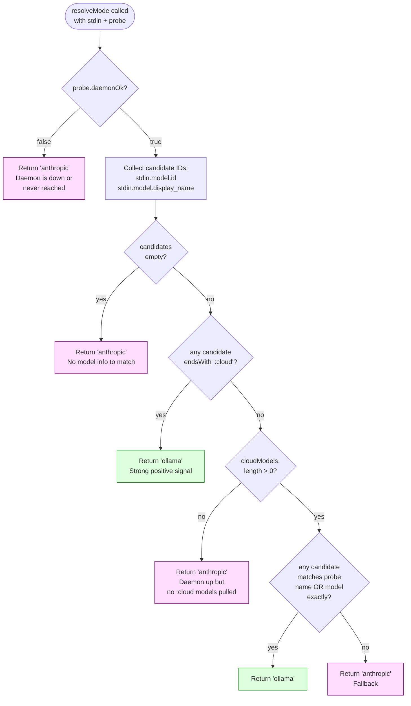

# Dual-Mode Detection

> **Diátaxis: Explanation.** Why ohud has two modes and how it picks. For the actual `resolveMode` field-by-field, see [reference/stdin-contract.md](../reference/stdin-contract.md).

## Why two modes exist

ohud was originally designed for users running Claude Code against an **Ollama Cloud** model (via Ollama's Anthropic-compatible endpoint at `localhost:11434`). For those users, the statusline ought to show:

- The cloud model with its parameter size badge (`⚡ 70B`)
- API duration (wall-clock latency)
- No "5h / 7d" rate-limit windows (those are an Anthropic-only concept)

But many users also run against **Anthropic's API directly** (Sonnet, Opus, Haiku). They need:

- The Anthropic model name without the `⚡` badge
- 5h / 7d usage windows
- Session cost estimation

ohud can't show both at once — they convey different information and would confuse the user. So **mode is mutually exclusive**, decided once per tick, and pivots which line renderers emit content.

## The decision flowchart



The four anthropic exits and two ollama exits each have distinct meanings:

| Exit | Meaning | User sees |
|---|---|---|
| `anth1` daemon down | Ollama not running, or `localhost:11434` unreachable | Anthropic mode lines (5h/7d, cost) |
| `anth2` no candidates | `stdin.model` was empty — can't tell anything | Anthropic mode lines |
| `anth3` no cloud models | Ollama running but no `:cloud` models pulled | Anthropic mode lines |
| `anth4` no match | Ollama up, has cloud models, but stdin model id doesn't match any | Anthropic mode lines (silent fallback) |
| `oll1` `:cloud` heuristic | `stdin.model.id` ends with `:cloud` — strong signal | Ollama mode lines (`⚡` badge, API ⏱) |
| `oll2` exact match | stdin model id exactly equals a `cloudModels[].name` | Ollama mode lines |

## Why the `:cloud` heuristic exists (separate from the exact match)

A naive implementation checks only `oll2`: does `stdin.model.id` exactly equal any `probe.cloudModels[].name`? That fails when the namespaces don't align. Concrete failure path:

1. User pulls `kimi-k2.6:cloud` via `ollama pull kimi-k2.6:cloud`.
2. `/api/tags` lists it as `name: "kimi-k2.6:cloud"`.
3. Claude Code sends `stdin.model.id = "kimi-k2.6"` (suffix may be stripped depending on version/transport).
4. Set intersection: `{"kimi-k2.6"}` ∩ `{"kimi-k2.6:cloud"}` = `∅` → returns `anthropic`.
5. ohud silently renders Anthropic-style usage bars while the user is actually on Ollama Cloud. **The user has no way to know detection failed.**

The heuristic in `oll1` (`endsWith(":cloud")`) is a strong positive signal that doesn't depend on namespace alignment. The verification script `scripts/verify-stdin-model-id.ts` walks `~/.claude/projects/` to capture real-world `stdin.model.id` values and confirm the heuristic catches them. See [hypothesis-verification.md](../hypothesis-verification.md).

## The trap: silent wrong-mode rendering

The most dangerous failure mode is **confidently wrong**: ohud picks one mode but the user is actually on the other. The user sees plausible numbers — for the wrong reasons.

The architecture has three guards against this:

```mermaid
flowchart LR
    A[probe correctness] --> D{user sees<br/>correct mode?}
    B[stale-cache TTL split] --> D
    C[/ohud doctor explicit display] --> D
    D -->|Yes| safe([safe])
    D -->|No, undetected| risk([silent wrong-mode])
    D -->|No, but flagged| obs([observable failure])
```

- **probe correctness**: `resolveMode` itself is pure and deterministic given inputs. Tests cover all 6 exits.
- **stale-cache TTL split**: see [probe-cache-policy.md](probe-cache-policy.md). Daemon liveness re-confirms every 5s; the prior wrong-mode window of up to 60s collapses to ≤5s.
- **/ohud doctor**: prints the resolved mode AND the reason fields, so the user can verify alignment when something feels off. See [reference/slash-commands.md](../reference/slash-commands.md).

## Code references

- `src/mode.ts:1-22` — the function itself
- `src/types.ts:RenderMode` — the `"ollama" | "anthropic"` union
- `tests/mode.test.ts` — full matrix of 6 exit branches
- `scripts/verify-stdin-model-id.ts` — empirical verification
- `docs/hypothesis-verification.md` — what we proved with the verification

## Read next

- **[Probe cache policy](probe-cache-policy.md)** — why two TTLs, how stale gets handled.
- **[reference/stdin-contract.md](../reference/stdin-contract.md)** — exact JSON shape from Claude Code.
- **[how-to/enable-ollama-cloud-mode.md](../how-to/enable-ollama-cloud-mode.md)** — concrete setup steps.
