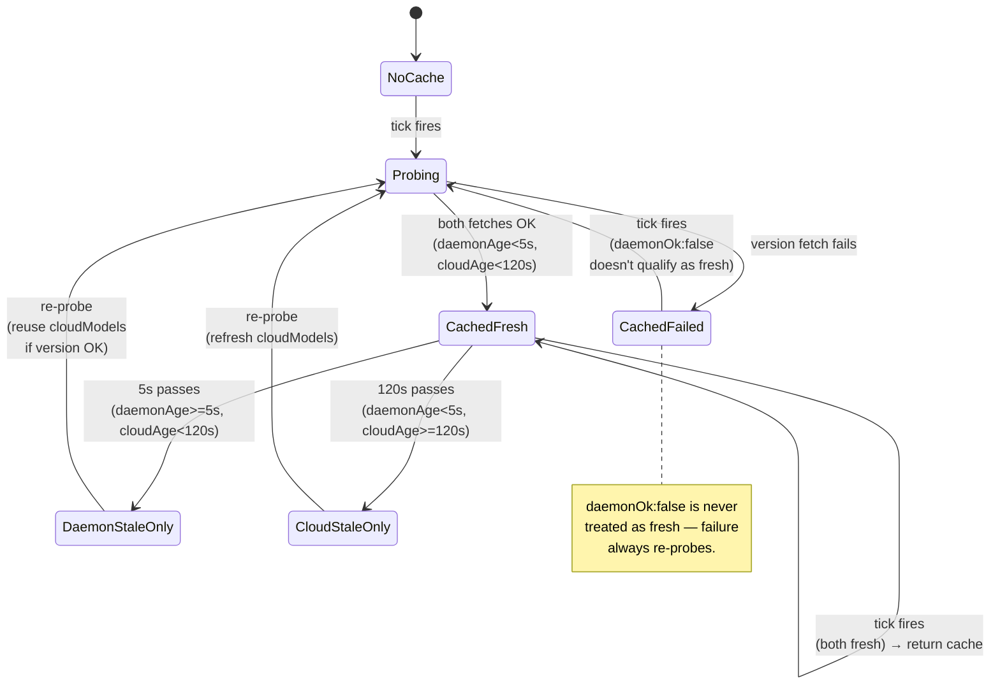
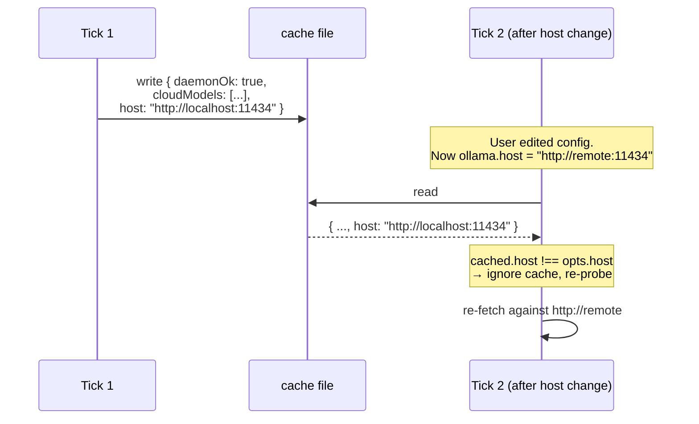

# Probe Cache Policy

> **Diátaxis: Explanation.** The reasoning behind ohud's two TTLs and atomic write. For exact field types, see [reference/config-schema.md](../reference/config-schema.md#ollama).

## The problem

Every tick (≈300 ms), ohud needs to know two things from the Ollama daemon:

1. **Is the daemon up?** (drives mode selection: down → anthropic mode)
2. **Which `:cloud` models are available?** (used to badge the model name and resolve mode)

Each of those answers comes from an HTTP request to `localhost:11434`:

- `GET /api/version` — answers (1)
- `GET /api/tags` — answers (2)

A naive design just calls both every tick. That's 2 HTTP requests × 300 ms cadence = constant local-network chatter, plus when the daemon hangs, ohud blocks the whole 300 ms budget waiting for a timeout.

A naive cache fixes the blocking but introduces a new bug: **stale answers**.

## Why a single TTL was wrong

The pre-fix design had `probeCacheTtlSeconds: 60`. One number governed both `daemonOk` and `cloudModels`. The failure mode:

```
T+0s   ohud probe runs. Daemon is up. Cache written: { daemonOk: true, cloudModels: [...] }
T+5s   User runs `pkill ollama` (laptop sleeps; daemon crashes; whatever)
T+5..60s  Every tick reads the stale cache. ohud confidently renders Ollama mode.
       The "API ⏱ 4m 12s" line shows numbers that come from a totally
       unrelated source (stdin.cost.total_api_duration_ms, which is the
       Anthropic-API-side wall clock, not the local Ollama daemon at all).
T+60s  Cache expires. Real probe runs. Now mode flips to anthropic.
       Statusline visually changes — user sees the "API ⏱" line disappear.
```

The user was lied to for up to 60 seconds. Silently. With confident-looking numbers.

The mirror case is just as bad: cache says `daemonOk: false`, daemon comes up, ohud renders Anthropic mode (with potentially garbage 5h/7d data) until cache expires.

## The fix: split-TTL

The two pieces of information have **fundamentally different freshness requirements**:

| Field | What it tracks | How fast it changes | Right TTL |
|---|---|---|---|
| `daemonOk` | Daemon process alive? | Can flip in 1 second | Short (5s) |
| `cloudModels` | List of `:cloud` models pulled | Changes only on `ollama pull/rm` | Long (120s) |

`HudConfig.ollama` exposes both:

```ts
ollama: {
  host: string;
  daemonTtlSeconds: number;        // default 5
  cloudModelsTtlSeconds: number;   // default 120
  probeTimeoutMs: number;          // default 500
};
```

## State diagram



The asymmetric handling is deliberate: a daemon that just **came up** must be detected within ~5s (mode flips to ollama). A daemon that just **went down** also takes ~5s to detect.

## Reusing `cloudModels` when only daemon is stale

When the daemon TTL expires but cloudModels TTL hasn't, ohud could either:
- (a) Discard the whole cache and re-fetch both
- (b) Keep `cloudModels` from cache and only re-probe `/api/version`

ohud takes path (a) — it always re-fetches both via `Promise.all` — but **reuses** `cached.cloudModels` if `/api/tags` fails (e.g., transient daemon error during a model pull). This way:

- Happy path: tags succeed, list updates.
- Sad path: tags fail but version succeeded, fall back to known list.

Code is in `src/ollama-probe.ts` lines starting around the cache-hit early return. Both fetches happen via `Promise.all` so latency is `max(versionFetch, tagsFetch)` not their sum.

## Host invalidation

Cache key is `tmpdir/ohud-probe-<sessionId>.json`. If the user edits `~/.claude/plugins/ohud/config.json` mid-session and points `ollama.host` somewhere else, the next tick must NOT serve the previous host's daemon view.



The `host` field is included in `OllamaProbeResult` for exactly this reason. Without it, the cache silently poisons across host changes.

## Atomic write

Cache writes use `.tmp + rename` instead of direct `writeFileSync`:

```ts
const tmp = path + ".tmp";
writeFileSync(tmp, JSON.stringify(data));
renameSync(tmp, path); // atomic on POSIX
```

Concurrent ticks (e.g., two Claude Code sessions sharing `sessionId="default"` on the fallback path) could otherwise interleave a half-written JSON. POSIX `rename` is atomic — readers see either the old file or the new file, never a torn write.

## Performance characteristics

Measured on macOS 25.5, Node 24.x, against a healthy local Ollama daemon:

| Scenario | Observed latency |
|---|---|
| Cache hit (both TTLs fresh) | < 1 ms |
| Cache miss, daemon healthy, parallel fetches | 25–35 ms |
| Cache miss, daemon hung | up to 500 ms (single timeout) |
| Cache miss, daemon hung, parallel fetches | up to 500 ms (still — `max(t,t)` not `t+t`) |

Sequential fetch (pre-Task 11 design) had worst case `2 × 500 = 1000 ms` on hung daemon — three times the budget. Parallel halves that. The split-TTL means the cache-miss tail is hit ~1 in 17 ticks at default 5s daemon TTL × 300 ms cadence — not every minute.

## When to tune

The defaults (5s, 120s, 500ms timeout) are calibrated for "local laptop with daemon at localhost". You might tune:

- **Slow Ollama on remote host?** Increase `probeTimeoutMs` to 1500+. Otherwise probe will timeout falsely on every cache miss.
- **Daemon known-stable?** Bump `daemonTtlSeconds` to 30. Trade-off: longer wrong-mode window when daemon dies.
- **CI/headless test environment?** Set `daemonTtlSeconds: 600` to skip probe almost entirely (you know it's not running).

## Code references

- `src/ollama-probe.ts` — the whole cache + fetch + atomic write logic
- `src/types.ts:OllamaProbeResult` — cache shape including `cloudModelsAt` and `host`
- `tests/ollama-probe.test.ts` — covers stale-on-failure, host-invalidation, atomic-write paths

## Read next

- **[Dual-mode detection](dual-mode-detection.md)** — how the cached probe feeds `resolveMode`.
- **[The 300ms budget](300ms-budget.md)** — where probe latency fits in the overall envelope.
- **[reference/config-schema.md](../reference/config-schema.md#ollama)** — TTL field definitions.
