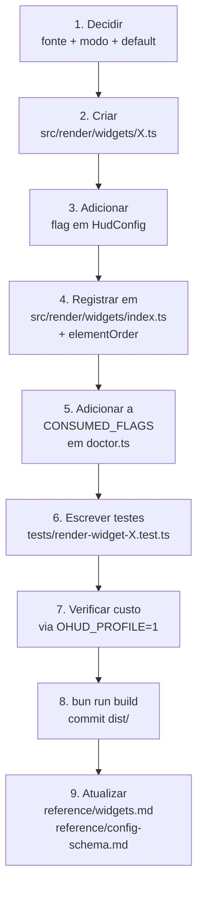

# How-To: Add a New Widget

> **Diátaxis: How-To.** Tarefa: criar um 13º widget (além dos 12 atuais documentados em [reference/widgets.md](../reference/widgets.md)). Receita end-to-end com TypeScript, testes, e wiring.

Esta página assume que você já clonou o repo e roda `bun test`. Se ainda não:

```bash
git clone https://github.com/nicolaslima/ohud
cd ohud
bun install
bun test    # 103 testes devem passar
```

## Passo 0 — Decida o que o módulo mostra

Pergunte:

| Pergunta | Por quê |
|---|---|
| Qual campo do stdin / transcript / probe alimenta este módulo? | Se a fonte não existe no `RenderContext`, você precisa adicioná-la primeiro. |
| Em que modo? `any` / `ollama` / `anthropic`? | Determina o early-return. |
| É default-on ou default-off? | Default-off significa custo zero para usuários que não querem. Prefira off para módulos novos. |
| Pode ser `null`? Sob quais condições? | Definir cedo evita "linha sempre lá mas vazia" — a pior UX. |

Vamos usar um exemplo concreto: **mostrar a versão do Node/Bun em uso** (`process.version` + `process.argv0`). Útil para sanity-check em sessões com múltiplos runtimes.

## Passo 1 — Criar o widget

Arquivo: `src/render/widgets/runtime.ts`

O widget implementa a interface `Widget` (`src/render/widget.ts`). O método `render()` produz output Row (ANSI completo). O método `renderHush()` (opcional) produz um `HushCell` plain-text para o layout Hush.

```ts
import type { Widget, WidgetCell } from "../widget.js";
import type { RenderContext } from "../../types.js";
import { color } from "../colors.js";
import { maxLineWidth } from "./_util.js";

export const runtimeWidget: Widget = {
  id: "runtime",
  group: "metrics",
  priority: 35,   // lower than duration (40), above environment (30)
  minWidth: 14,

  render(ctx: RenderContext): WidgetCell | null {
    if (!ctx.config.display.showRuntime) return null;
    const c = ctx.config.colors;
    const ver = process.version;
    const argv0 = process.argv0;
    const body = `${color(c.label, "runtime")} ${color(c.label, `${argv0} ${ver}`)}`;
    return { body, visualWidth: maxLineWidth(body) };
  },
};
```

`★ Padrão:` early-return em `null` para fail-soft. Nunca lance exception — caller já tem catch genérico mas null é mais barato.

## Passo 2 — Adicionar a flag em `HudConfig`

`src/types.ts`:

```ts
export interface HudConfigDisplay {
  // ... outras flags ...
  showRuntime: boolean;  // ← novo
}
```

`src/config.ts`:

```ts
export const DEFAULT_CONFIG: HudConfig = {
  // ...
  display: {
    // ... outras flags ...
    showRuntime: false,  // ← default-off
  },
};
```

## Passo 3 — Registrar no widget registry

`src/render/widgets/index.ts` mantém o array `WIDGETS`. Adicione:

```ts
import { runtimeWidget } from "./runtime.js";

export const WIDGETS: readonly Widget[] = [
  // ... existentes ...
  runtimeWidget,   // ← novo
];
```

Adicione `"runtime"` ao default `elementOrder` em `src/config.ts:DEFAULT_CONFIG.elementOrder`:

```ts
elementOrder: [
  "project", "context", "apiTime", "usage",
  "cost", "promptCache", "memory", "environment",
  "tools", "agents", "todos",
  "runtime",  // ← novo (no fim por enquanto; user pode reordenar)
],
```

## Passo 4 — Adicionar ao doctor

`/ohud doctor` lista flags como `consumed` ou `DEAD FLAG`. Adicione `showRuntime` ao Set de flags consumidas:

`src/doctor.ts`:

```ts
const CONSUMED_FLAGS = new Set([
  // ... existentes ...
  "showRuntime",  // ← novo
]);
```

Sem isso, doctor vai mostrar sua flag nova como `DEAD FLAG` mesmo funcionando — fonte de confusão.

## Passo 5 — Escrever o teste

Crie `tests/render-widget-runtime.test.ts`. Use `widget.render(ctx)` (Option a — sem API surface extra):

```ts
import { test, expect } from "bun:test";
import { runtimeWidget } from "../src/render/widgets/runtime.js";
import { DEFAULT_CONFIG } from "../src/config.js";
import type { RenderContext } from "../src/types.js";

function makeCtx(): RenderContext {
  return {
    mode: "anthropic",
    stdin: {},
    transcript: { tools: [], agents: [], todos: [] },
    gitStatus: null,
    config: structuredClone(DEFAULT_CONFIG),
    usageData: null, costData: null, memoryInfo: null, cloudModels: [],
  };
}

test("runtimeWidget.render returns null when showRuntime is off", () => {
  const ctx = makeCtx();
  // showRuntime defaults to false
  expect(runtimeWidget.render(ctx)).toBeNull();
});

test("runtimeWidget.render includes version when flag is on", () => {
  const ctx = makeCtx();
  (ctx.config.display as Record<string, unknown>).showRuntime = true;
  const cell = runtimeWidget.render(ctx);
  expect(cell).not.toBeNull();
  expect(cell!.body).toContain("runtime");
  expect(cell!.body).toContain(process.version);
});
```

Rode:

```bash
bun test tests/render-widget-runtime.test.ts
```

Os 2 testes devem passar.

## Passo 6 — Cuidado com cold-start

ohud tem orçamento de ~300ms ([explanation/300ms-budget.md](../explanation/300ms-budget.md)). Cada renderer novo paga:

- Parse do .ts em `dist/index.js` no cold-start (esbuild bundla — typicamente +50-200 bytes).
- Execução do renderer em todo tick.

Para `runtime`, o custo é nano: lê duas variáveis de processo. Mas se seu módulo:

- Lê arquivos do FS → cache via stat (`mtimeMs + size`) como `transcript.ts` faz.
- Faz HTTP → adicione TTL longo, falhe rápido (timeout < 200ms).
- Spawna subprocesses → reconsidere. ohud já é spawn-per-tick; spawnar de novo dentro dele é frágil.

Se o módulo tem qualquer custo > 5ms, mediu antes de fazer commit:

```bash
OHUD_PROFILE=1 node dist/index.js < /tmp/sample-stdin.json
# Espere: ohud-profile: total=XXms
# Se subiu mais que ~10ms, investigue.
```

## Passo 7 — Buildar e verificar

CI roda `bun run build && git diff --exit-code dist/`. Build localmente antes de commit:

```bash
bun run build
git status     # dist/index.js deve estar modificado
```

Se `dist/` não está sendo commitado, CI falha. Ver [explanation/design-decisions.md](../explanation/design-decisions.md#why-dist-is-committed-to-git) para o porquê.

## Passo 8 — Documentar

A documentação não é opcional. Atualize:

1. **`docs/reference/widgets.md`** — adicione uma linha na tabela de resumo e uma seção completa com id, group, priority, minWidth, Row render, Hush render.
2. **`docs/reference/config-schema.md`** — linha na tabela de `display.*`.
3. **`docs/explanation/architecture.md`** se o widget introduziu um padrão arquitetural novo (raro).

Sem update da reference, usuários não sabem que a flag existe — ela vira dead-flag-by-omission.

## Receita visual completa



## Anti-padrões a evitar

| Tentação | Por que evitar |
|---|---|
| Renderer com side effects (escreve arquivo, manda HTTP) | Cada tick re-roda. Spam de I/O. Cache se precisa de I/O. |
| Renderer que sempre retorna string (nunca null) | Linha eternamente lá mesmo sem dado real. Ruído. Use `null` quando os dados estão ausentes. |
| Renderer que joga exceção | ohud já tem catch genérico mas a sentinel vermelha aparece para o usuário. Use try/catch no renderer e retorne `null` em erro. |
| Adicionar dep ao `package.json:dependencies` | Quebra zero-deps invariant. ohud bundla com esbuild → tudo vai pro `dist/index.js`. ~50KB de dep extra é hostil ao cold-start. Re-implemente o que precisa em <50 linhas. |
| Fazer o renderer ler `~/.claude/...` direto | Existing modules já consolidam (config.ts, transcript.ts). Reuse helpers em vez de re-inventar paths. |

## See also

- [reference/widgets.md](../reference/widgets.md) — catálogo completo dos 12 widgets atuais.
- [reference/config-schema.md](../reference/config-schema.md) — onde adicionar a flag.
- [explanation/architecture.md](../explanation/architecture.md) — `RenderContext` shape + Layout strategies.
- [explanation/design-decisions.md](../explanation/design-decisions.md#zero-runtime-dependencies) — invariantes a preservar.
