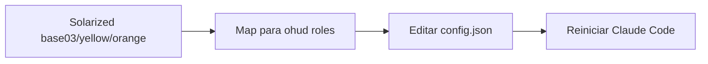

# How-To: Customize Colors and Glyphs

> **Diátaxis: How-To.** Tarefa: ajustar cores e símbolos da statusline para combinar com seu tema de terminal ou preferências visuais. Para a referência exaustiva de campos, ver [reference/config-schema.md](../reference/config-schema.md#colors).

## Onde editar

```bash
~/.claude/plugins/ohud/config.json
```

Esse arquivo controla cores, glyphs, layout. Edite com qualquer editor:

```bash
$EDITOR ~/.claude/plugins/ohud/config.json
```

Após salvar, **reinicie Claude Code** para a próxima statusline rerenderizar com os novos valores. ohud é stateless por tick — não há reload em tempo real.

## Anatomia da config

```json
{
  "lineLayout": "expanded",
  "display": {
    "glyphs": "auto"
  },
  "colors": {
    "context": "green",
    "apiTime": "brightBlue",
    "usage": "brightBlue",
    "warning": "yellow",
    "usageWarning": "brightMagenta",
    "critical": "red",
    "model": "cyan",
    "project": "yellow",
    "git": "magenta",
    "gitBranch": "cyan",
    "label": "dim"
  }
}
```

Cada chave em `colors.*` aceita três formatos:

| Formato | Exemplo | Onde usar |
|---|---|---|
| Nome | `"green"`, `"brightBlue"`, `"dim"` | Cores básicas. 8 nomes suportados (ver tabela abaixo). |
| Índice 256-cores | `"166"`, `"39"`, `"208"` | Quando você quer um tom específico que não tem nome. |
| Hex RGB | `"#FF6B00"`, `"#3DDBD9"` | Combinação exata com tema custom. |

**Nomes suportados** (qualquer outra string vira plain text — efetivamente "sem cor"):

```
dim, red, green, yellow, magenta, cyan, brightBlue, brightMagenta
```

> **Por que tão poucos nomes?** ohud tem zero deps por design. Cada nome adicional é mais código no bundle, mais cold-start. Os 8 cobrem todos os usos atuais. Para o resto, use 256-cores ou hex. Ver [explanation/design-decisions.md](../explanation/design-decisions.md#zero-runtime-dependencies).

## Receita 1 — Tema "Solarized Dark"



Use os hex codes oficiais do Solarized:

```json
{
  "colors": {
    "context": "#859900",
    "apiTime": "#268BD2",
    "usage": "#268BD2",
    "warning": "#B58900",
    "usageWarning": "#D33682",
    "critical": "#DC322F",
    "model": "#2AA198",
    "project": "#B58900",
    "git": "#6C71C4",
    "gitBranch": "#2AA198",
    "label": "#586E75"
  }
}
```

## Receita 2 — Tema "Catppuccin Mocha"

```json
{
  "colors": {
    "context": "#A6E3A1",
    "apiTime": "#89B4FA",
    "usage": "#89B4FA",
    "warning": "#F9E2AF",
    "usageWarning": "#F5C2E7",
    "critical": "#F38BA8",
    "model": "#94E2D5",
    "project": "#FAB387",
    "git": "#CBA6F7",
    "gitBranch": "#74C7EC",
    "label": "#6C7086"
  }
}
```

## Receita 3 — Tema acessível para daltonismo

Pessoas com deuteranopia / protanopia confundem vermelho-verde. Use azul / amarelo / púrpura como dimensões discriminantes:

```json
{
  "colors": {
    "context": "#0173B2",
    "apiTime": "#0173B2",
    "usage": "#0173B2",
    "warning": "#DE8F05",
    "usageWarning": "#CC78BC",
    "critical": "#CC78BC",
    "model": "#56B4E9",
    "project": "#DE8F05",
    "git": "#CC78BC",
    "gitBranch": "#56B4E9",
    "label": "#999999"
  }
}
```

Combinado com `display.glyphs: "unicode"`, os glyphs unicode adicionam sinal visual além de cor.

## Glyphs — unicode vs ascii

ohud emite glyphs como `⚡ ⏱ ◐ ✓ ▸ █ ░ │ ↑ ↓`. Em terminais sem suporte UTF-8, viram caracteres lixo. Por isso existe `display.glyphs`:

| Setting | Comportamento |
|---|---|
| `"auto"` (default) | Detecta `LANG` / `LC_ALL`. Se contém `UTF-8` → unicode. Senão → ascii. |
| `"unicode"` | Força unicode independente do env. |
| `"ascii"` | Força ascii independente do env. |

Glyph fallback table (`src/render/glyphs.ts`):

| Conceito | Unicode | ASCII |
|---|---|---|
| Bolt (modelo cloud) | `⚡` | `*` |
| Clock (api time) | `⏱` | `t` |
| Running (tool ativo) | `◐` | `o` |
| Done (tool completo) | `✓` | `x` |
| Active todo | `▸` | `>` |
| Separator | `│` | `\|` |
| Bar full | `█` | `#` |
| Bar empty | `░` | `.` |
| Up arrow | `↑` | `^` |
| Down arrow | `↓` | `v` |

### Quando forçar ASCII

- Você usa `screen` ou `tmux` com configuração não-UTF-8.
- Terminal antigo (xterm-color clássico, conexões serial).
- Scripts capturando a statusline para análise (parsing fica mais robusto).
- Você prefere o look retrô.

```json
{
  "display": {
    "glyphs": "ascii"
  }
}
```

### Quando forçar unicode

- Você sabe que seu terminal renderiza UTF-8 mas `LANG` está `C` ou `POSIX`.
- Você está num container Docker minimalista que não setou `LANG`.

```json
{
  "display": {
    "glyphs": "unicode"
  }
}
```

## Verificar o resultado

Antes de reiniciar Claude Code, dá pra testar localmente:

```bash
# Construa um stdin sintético
echo '{
  "cwd": "/tmp/test",
  "model": {"id": "claude-sonnet-4-6"},
  "context_window": {"used_percentage": 73}
}' | node "$CLAUDE_PLUGIN_ROOT/dist/index.js"
```

Se as cores não mudaram, verifique:

1. JSON é válido? `cat ~/.claude/plugins/ohud/config.json | jq .`
2. `NO_COLOR` está unset? `echo "NO_COLOR=$NO_COLOR"` (vazio = ok)
3. Terminal suporta a cor? Hex/256-cores precisam de truecolor.

Se nenhuma cor aparecer mas a statusline renderiza: ver [work-in-restricted-terminals.md](work-in-restricted-terminals.md).

## Anti-padrões a evitar

| Tentação | Por que evitar | Faça em vez disso |
|---|---|---|
| Editar `dist/index.js` direto | Próximo `bun run build` sobrescreve. CI guard falha. | Edite `config.json`. |
| Inventar nomes de cor (`"orange"`, `"pink"`) | ohud só conhece 8 nomes. Strings desconhecidas viram plain text — sem warning. | Use 256-cores (`"208"` para laranja) ou hex. |
| Setar `colors.label: "white"` | `"white"` não está na lista. Vira plain text. Labels viram invisíveis em terminais com fg=white. | Use `"dim"` (default) ou hex específico. |
| Mudar cores em produção sem testar | Algumas combinações são ilegíveis. | Use o teste com stdin sintético acima primeiro. |

## See also

- [reference/config-schema.md](../reference/config-schema.md#colors) — todas as keys de `colors.*`.
- [reference/environment-variables.md](../reference/environment-variables.md) — `NO_COLOR`, `LANG`, `LC_ALL` e impacto.
- [how-to/work-in-restricted-terminals.md](work-in-restricted-terminals.md) — quando cores/glyphs vão falhar.
