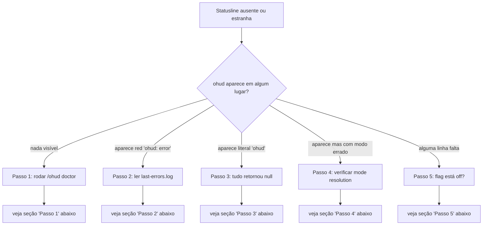

# How-To: Diagnose a Blank or Wrong Statusline

> **Diátaxis: How-To.** Tarefa: "minha statusline está em branco / mostra a coisa errada". Esta página é um fluxograma de diagnóstico. Para a teoria de *por que* falhas se manifestam como blank, ver [explanation/architecture.md](../explanation/architecture.md#failure-modes-and-observability).

## Antes de começar

Verifique uma coisa primeiro: a statusline aparece **uma vez por mensagem do agente**. Se você acabou de instalar e ainda não interagiu com Claude Code, ela não vai renderizar. Envie qualquer prompt e veja se aparece.

## Fluxo de decisão



---

## Passo 1: Rode `/ohud doctor`

```
/ohud doctor
```

Este é o primeiro comando em **qualquer** investigação. Saída esperada:

```
ohud version: 0.1.0
runtime: v22.22.2 (process.argv0=node)
resolved bundle: /Users/me/.claude/plugins/cache/.../ohud/dist/index.js (exists: yes)
probe: live (cache bypassed) — daemonOk: yes
cloud models: gemma4:31b-cloud, glm-4.7:cloud
mode: ollama-capable

active config flags (consumed?):
  display.showModel: true (consumed)
  display.showCost: false (consumed)
  ...
```

### Sintoma → ação

| O que doctor mostra | O que isso significa | Ação |
|---|---|---|
| `resolved bundle: ... (exists: no)` | `dist/index.js` não existe no caminho do plugin. | Re-instale: `/plugin remove ohud` depois `/plugin install ohud`. |
| `runtime: v18.x.x` | Node 18 é o piso suportado. Tudo ok. | Nada a fazer. |
| `runtime: v16.x.x` ou menor | Abaixo do piso. ESM ou `fetch` podem falhar. | Atualize Node para ≥18 ou instale Bun. |
| `probe: live ... daemonOk: no` + você roda Ollama | Daemon não está respondendo em `ollama.host`. | Verifique `ollama serve`. Veja [enable-ollama-cloud-mode.md](enable-ollama-cloud-mode.md). |
| `mode: anthropic` mas você espera Ollama | Modelo do stdin não casa com cloudModels nem termina em `:cloud`. | Ver [Passo 4](#passo-4-verificar-mode-resolution). |
| Várias flags marcadas `(DEAD FLAG)` | Você está usando flags que ohud v0.1 não consome. | Não é um bug — informativo. As flags vivas funcionam normalmente. |
| Seção `last errors` lista entries recentes | Houve exceção em ticks recentes. | Ver [Passo 2](#passo-2-ler-last-errorslog). |

Se doctor não roda — Claude Code mostra "Unknown command" — o plugin não está instalado ou foi instalado em um marketplace que não foi adicionado. Faça `/plugin marketplace add nicolaslima/ohud-plugins` e depois `/plugin install ohud`.

---

## Passo 2: Ler `last-errors.log`

```bash
tail -n 20 ~/.claude/plugins/ohud/last-errors.log
```

Este arquivo só existe se ohud capturou exceções. Cada linha tem timestamp + mensagem:

```
[2026-05-09T14:22:11.342Z] TypeError: Cannot read properties of undefined (reading 'includes')
[2026-05-09T14:22:14.881Z] ENOENT: no such file or directory, open '/path/that/moved'
```

### Causas comuns

| Mensagem típica | Causa | Fix |
|---|---|---|
| `Cannot read ... of undefined` em `transcript.ts` | Transcript JSONL malformado (ainda sendo escrito quando ohud leu) | Aguarde 1-2 ticks; resolve sozinho. Se persiste por minutos, transcript pode estar corrompido — feche e reabra a sessão. |
| `ENOENT ... config.json` | `~/.claude/plugins/ohud/config.json` removido manualmente | ohud volta a `DEFAULT_CONFIG` automaticamente. Não é fatal — pode ignorar. |
| `AbortError` em `ollama-probe` | Daemon Ollama timeout | Aumente `ollama.probeTimeoutMs` no config (default 500ms) ou desabilite probe agressivo subindo `daemonTtlSeconds` para `600`. |
| `EACCES` ao escrever cache | Permissão na pasta `~/.claude/plugins/ohud/` | `chmod -R u+w ~/.claude/plugins/ohud/` |

Quando arrumou: limpe o log para começar fresh.

```bash
rm ~/.claude/plugins/ohud/last-errors.log
```

---

## Passo 3: Aparece literal `ohud` (1 palavra, sem mais nada)

Esta é a [linha mínima de fallback](../explanation/architecture.md#failure-modes-and-observability) — todos os 12 renderers retornaram `null`.

### Como debugar

Rode ohud diretamente com profiling, alimentando o stdin de uma sessão real:

```bash
# 1. Capture um stdin recente de uma sessão Claude Code
ls -t ~/.claude/projects/-Users-*/*.jsonl | head -1
# Use esse path para extrair um stdin JSON. Estrutura típica:
# {"cwd":"...","session_id":"...","model":{...},...}

# 2. Cole o JSON em /tmp/sample.json e teste
OHUD_PROFILE=1 node "$CLAUDE_PLUGIN_ROOT/dist/index.js" < /tmp/sample.json
```

Ou mais simples — use um stdin sintético mínimo:

```bash
echo '{"cwd":"/tmp","model":{"id":"claude-sonnet-4-6"},"context_window":{"used_percentage":42}}' \
  | node "$CLAUDE_PLUGIN_ROOT/dist/index.js"
```

Se este comando produz `[claude-sonnet-4-6] tmp │ Context ████░░░░░░ 42%`, o problema é o stdin que Claude Code está mandando. Verifique:

- Sua versão de Claude Code é ≥ a versão que ohud testou (`package.json:claudeCodeMin`)? Versões antigas podem omitir campos.
- Você está numa sessão extremamente nova (sem mensagens) onde `context_window` ainda não foi populado?

Se o comando direto também produz só `ohud`, abra um issue com o JSON sintético para reproduzir.

---

## Passo 4: Verificar mode resolution

ohud roda mas o badge do modelo está errado, ou linhas Ollama-only / Anthropic-only não aparecem quando deveriam.

### Capture o `model.id` real

`scripts/verify-stdin-model-id.ts` lê uma sessão JSONL recente e imprime os valores de `model.id` e `model.display_name`:

```bash
bun scripts/verify-stdin-model-id.ts
```

Saída exemplo:

```
session: 550e8400-e29b-41d4-a716-446655440000
  model.id:           glm-5:cloud
  model.display_name: glm-5:cloud
session: ...
  model.id:           gpt-oss:120b-cloud
  model.display_name: gpt-oss:120b-cloud
```

### Compare com `cloudModels`

Saída do `/ohud doctor` lista:

```
cloud models: gemma4:31b-cloud, glm-4.7:cloud
```

A regra é (`src/mode.ts:resolveMode`):

1. Se `model.id?.endsWith(":cloud")` → modo `ollama` (heurística do sufixo).
2. Senão, se `model.id` casa exato com algum `cloudModels[].name` → `ollama`.
3. Senão, se modelo casa pattern Anthropic (`claude-`, `sonnet-`, etc.) → `anthropic`.
4. Senão → `anthropic` por default.

Se seu modelo termina `:cloud` mas modo está vindo como `anthropic`: bug. Reporte.

Se seu modelo é Ollama mas **não** termina `:cloud` e **não** está em `cloudModels`: probe ainda não detectou. Force um refresh com `/ohud doctor` (que faz live probe).

---

## Passo 5: Uma linha específica não aparece

A causa quase sempre é flag `false`. Cada line module tem uma flag em `display.*` (ver [reference/line-modules.md](../reference/line-modules.md)).

### Ative todas para debugar

Edite `~/.claude/plugins/ohud/config.json`:

```json
{
  "display": {
    "showCost": true,
    "showPromptCache": true,
    "showTools": true,
    "showAgents": true,
    "showTodos": true,
    "showDuration": true,
    "showMemoryUsage": true
  }
}
```

Reinicie a sessão (Ctrl+D + reabrir, ou `/exit` + reabrir). Se a linha agora aparece — era a flag.

### Ou use `/ohud configure`

```
/ohud configure
```

Escolha preset **Full**. Equivale a ligar todos os `show*`.

### Linha aparece mas vazia / sem dados

Pode ser que o stdin não tem o campo necessário. Cross-reference com [reference/line-modules.md](../reference/line-modules.md) — coluna "Fonte primária".

Exemplos comuns:

| Linha | Some quando | Por quê |
|---|---|---|
| `apiTime` | modo Anthropic ou `total_api_duration_ms = 0` | Renderer só ativa em Ollama (`api-time.ts:7`). |
| `usage` | modo Ollama ou sem rate_limits no stdin | Renderer só ativa em Anthropic (`usage.ts:9`). |
| `cost` | modo Ollama | Custo zero é ruído (`cost.ts:7`). |
| `memory` | `lineLayout: "compact"` | Único renderer que respeita layout em v0.1 (`memory.ts:10`). |
| `duration` com `showSpeed: true` (sem `showDuration`) | sempre — `showSpeed` é inerte em v0.1 | `computeTokensPerSecond` retorna `null` (`duration.ts:32`). v0.2 vai implementar. |

---

## Quando nada acima funciona

Colete e envie:

1. Saída completa de `/ohud doctor`.
2. `tail -n 50 ~/.claude/plugins/ohud/last-errors.log` (ou "no log" se não existe).
3. Versão do Claude Code (`claude --version`).
4. Versão Node/Bun (`node --version`, `bun --version` se instalado).
5. Contents de `~/.claude/plugins/ohud/config.json` (redact paths sensíveis se necessário).

Abra issue em https://github.com/nicolaslima/ohud/issues com esses cinco itens. Reproduções determinísticas (com stdin JSON capturado) recebem fix prioritário.

---

## See also

- [reference/slash-commands.md](../reference/slash-commands.md) — `/ohud doctor` em detalhe.
- [explanation/architecture.md](../explanation/architecture.md#failure-modes-and-observability) — por que blank é o failure mode default.
- [how-to/enable-ollama-cloud-mode.md](enable-ollama-cloud-mode.md) — diagnóstico específico de daemon Ollama.
