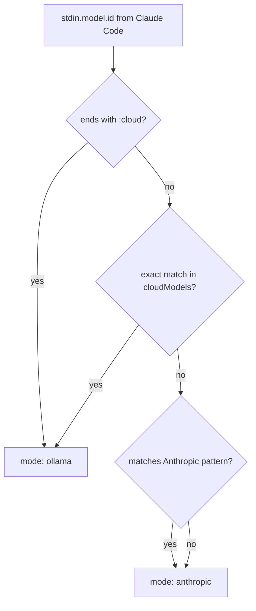

# How-To: Enable Ollama Cloud Mode

> **Diátaxis: How-To.** Tarefa: ver o badge de modelo enriquecido (`[gemma4:31b-cloud ⚡ 31b]`) e a linha `API ⏱` quando você está rodando Ollama. Para entender *por que* o modo Ollama existe, ver [explanation/dual-mode-detection.md](../explanation/dual-mode-detection.md).

## O que "Ollama mode" significa em ohud

Quando ohud detecta que o modelo ativo da sessão Claude Code é um modelo Ollama (`:cloud` suffix ou casa exato com cloudModels do daemon), ele:

- Anexa o glyph `⚡` + parameter size ao badge: `[gemma4:31b-cloud ⚡ 31b]`
- Habilita a linha `API ⏱ Xm Ys` (consumo de `cost.total_api_duration_ms`)
- Suprime as linhas Anthropic-only (`Usage` 5h/7d, `Cost`, `Cache`)

Sem o probe ou sem casamento, ohud cai em modo Anthropic.

## Passo 1: Verificar daemon Ollama

```bash
ollama --version
ollama list
```

Se Ollama não está instalado:

```bash
# macOS / Linux
curl -fsSL https://ollama.com/install.sh | sh
```

Suba o daemon:

```bash
ollama serve
# Daemon escuta em http://localhost:11434 por padrão
```

Em outro terminal, valide:

```bash
curl -s http://localhost:11434/api/version | jq .
# Saída esperada:
# { "version": "0.5.x" }
```

## Passo 2: Confirmar que ohud detecta o daemon

```
/ohud doctor
```

Saída relevante:

```
probe: live (cache bypassed) — daemonOk: yes
cloud models: gemma4:31b-cloud, glm-4.7:cloud, kimi-k2.6:cloud
mode: ollama-capable
```

Se `daemonOk: no`:

| Problema | Diagnóstico | Fix |
|---|---|---|
| `daemonOk: no` mas `ollama serve` rodando | Probe timeout. Default 500ms. | Aumente `ollama.probeTimeoutMs` no config para `1000`. |
| `daemonOk: no` e timeout em probe | Daemon escuta em porta diferente | Mude `ollama.host` no config para `http://localhost:PORT`. |
| `daemonOk: no` e Ollama em outro host | Daemon remoto | `ollama.host: "http://10.0.0.5:11434"` |

Edite `~/.claude/plugins/ohud/config.json`:

```json
{
  "ollama": {
    "host": "http://localhost:11434",
    "daemonTtlSeconds": 5,
    "cloudModelsTtlSeconds": 120,
    "probeTimeoutMs": 1000
  }
}
```

## Passo 3: Confirmar que o modelo casa

ohud entra em modo Ollama quando uma destas é verdadeira (`src/mode.ts`):

1. **Heurística do sufixo**: `stdin.model.id?.endsWith(":cloud")` → `ollama` direto.
2. **Casamento exato**: `stdin.model.id` é igual a algum `cloudModels[].name` retornado pelo probe.

Para descobrir o que Claude Code está mandando como `model.id`:

```bash
bun /Users/lima/Projects/ohud/scripts/verify-stdin-model-id.ts
```

Saída exemplo (sessões reais):

```
session: 550e8400-e29b-41d4-a716-446655440000
  model.id:           glm-5:cloud
  model.display_name: glm-5:cloud
  → matches via :cloud suffix → mode: ollama

session: 7c3d2f-...
  model.id:           claude-sonnet-4-6
  → no match → mode: anthropic
```



### Caso edge: você usa Ollama mas o modelo não termina `:cloud`

Por exemplo, você roda um modelo local como `llama3.3:70b` (sem `:cloud`). Esse modelo não vai estar em `cloudModels[]` (probe filtra para cloud-only). Então cai em Anthropic mode.

Em v0.1, **não há** flag para tratar todos os modelos Ollama como Ollama-mode. A heurística é cloud-models-only. v0.2 vai adicionar `mode: "force-ollama"` em config.

Workaround atual: rodar o modelo via Ollama Cloud (que adiciona o sufixo automaticamente) ou aceitar que o badge vai dizer "anthropic-style".

## Passo 4: Configurar Anthropic-only (sem probe)

Se você raramente usa Ollama mas tem o daemon instalado, o probe ainda dispara em todo tick. Custo: ~5-50ms quando cache mete. Para evitar:

```json
{
  "ollama": {
    "host": "http://localhost:11434",
    "daemonTtlSeconds": 600,
    "cloudModelsTtlSeconds": 600,
    "probeTimeoutMs": 100
  }
}
```

- TTL altíssimo: primeiro probe falhado fica cacheado por 10 minutos.
- Timeout curtíssimo: probe desiste em 100ms — mal afeta cold-start.
- ohud passa direto para modo Anthropic em ticks subsequentes.

Funciona como "desligar Ollama mode" sem código novo.

## Passo 5: Testar a linha `API ⏱`

Ela só aparece quando:

- `mode === "ollama"` (passos 1-3 acima)
- `display.showApiTime: true` (default)
- `stdin.cost.total_api_duration_ms > 0`

O último é populado por Claude Code quando há atividade real de API. Em sessão fresca antes da primeira mensagem, é zero — linha some. Mande um prompt qualquer e ela aparece.

Sample stdin para teste local:

```bash
echo '{
  "cwd": "/tmp",
  "model": {"id": "glm-5:cloud", "display_name": "glm-5:cloud"},
  "context_window": {"used_percentage": 30},
  "cost": {"total_api_duration_ms": 84000}
}' | node "$CLAUDE_PLUGIN_ROOT/dist/index.js"
```

Saída esperada (com cores e modo Ollama):

```
[glm-5:cloud ⚡ ?b] tmp │ Context ████░░░░░░ 30% │ API ⏱ 1m 24s
```

> **`?b` em vez do parameter size?** Significa que o probe tá rodando mas seu `glm-5:cloud` específico não está em `cloudModels[]`, ou `details.parameter_size` está ausente. Isso é cosmético — modo Ollama está ativo, só falta o badge polish.

## Anti-padrões

| Tentação | Por que evitar |
|---|---|
| Setar `OHUD_HOST=http://...` em env | ohud não lê env vars de Ollama. Use `ollama.host` no config. |
| Aumentar `probeTimeoutMs` para 5000ms | Probe roda em todo tick. Lenta o cold-start drasticamente. Default 500ms é bem dimensionado. |
| Desabilitar probe completamente removendo `ollama` do config | Probe ainda roda com defaults. Edite `cloudModelsTtlSeconds` em vez disso. |
| `ollama.host: "http://0.0.0.0:11434"` | `0.0.0.0` é bind, não destino. Use `localhost` ou IP real. |

## See also

- [reference/config-schema.md](../reference/config-schema.md#ollama) — todos os campos `ollama.*`.
- [explanation/probe-cache-policy.md](../explanation/probe-cache-policy.md) — split-TTL rationale.
- [explanation/dual-mode-detection.md](../explanation/dual-mode-detection.md) — pourquoi a heurística do `:cloud`.
- [how-to/diagnose-blank-statusline.md](diagnose-blank-statusline.md#passo-4-verificar-mode-resolution) — quando o modo está errado.
