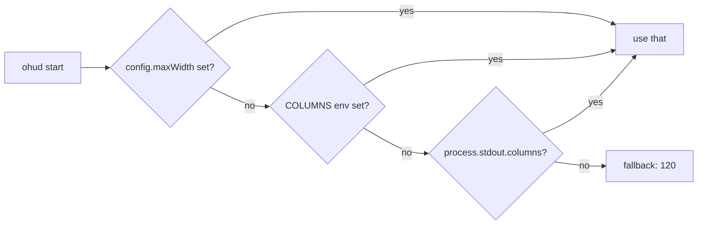

# How-To: Work in Restricted Terminals

> **Diátaxis: How-To.** Tarefa: fazer ohud ficar legível em terminais sem ANSI colors, sem UTF-8, sem suporte a width queries, ou em pipelines não-interativos (CI logs, screen readers, scripts).

ohud foi pensado para falhar suavemente nesses ambientes — mas você ainda precisa **acionar** as flags certas. Esta página lista os cenários e a config mínima para cada.

## Cenário 1 — CI logs, ANSI escape vira lixo

**Sintoma:**
```
\x1b[36m[claude-sonnet-4-6]\x1b[0m \x1b[33mohud\x1b[0m...
```

ANSI escape codes literais aparecem no log. O agent UI não interpreta cores.

**Fix:** setar `NO_COLOR=1` no ambiente do CI:

```yaml
# GitHub Actions example
env:
  NO_COLOR: "1"
```

ohud detecta `NO_COLOR` definida-e-não-vazia → desativa cores em todas as chamadas `color()`.

**Verificar:**
```bash
NO_COLOR=1 bun run dist/index.js < /tmp/sample-stdin.json
```

A saída deve ser plain text sem `\x1b[...]`.

> **Por que `NO_COLOR=""` não funciona?** ohud segue [no-color.org](https://no-color.org) à risca: "valor não-vazio" é o trigger. Empty string não conta. Use `NO_COLOR=1` ou `NO_COLOR=true` ou qualquer valor não-vazio.

## Cenário 2 — Terminal sem UTF-8

**Sintoma:** Glyphs como `⚡ ⏱ ◐ █` aparecem como `?` ou `??`:
```
[claude] ohud │ Context ?? 43% │ API ? 1m 24s
```

**Fix:** force ASCII em config:

```json
{
  "display": {
    "glyphs": "ascii"
  }
}
```

Ou via env (`auto` mode resolve via `LANG`):

```bash
LANG=C.UTF-8 bun run dist/index.js
# ou para forçar ASCII:
LANG=C bun run dist/index.js
```

ASCII fallback table — todos os símbolos têm equivalente single-byte:

```
⚡ → *    ⏱ → t    ◐ → o    ✓ → x    ▸ → >
│ → |    █ → #    ░ → .    ↑ → ^    ↓ → v
```

Visualmente menos polido mas perfeitamente legível e parsável.

## Cenário 3 — Terminal "dumb" (emacs shell, serial console)

**Sintoma:** Cores não funcionam mesmo sem `NO_COLOR`. O terminal não interpreta ANSI.

**Fix:** ohud detecta automaticamente se `TERM === "dumb"` e desliga cores. Nada a fazer.

Se precisa forçar manualmente em outros terminais:

```bash
TERM=dumb bun run dist/index.js
```

## Cenário 4 — Largura desconhecida (pipe, redirect)

**Sintoma:** Lines longas se enrolam ou são cortadas em ponto inesperado.

ohud lê largura nesta ordem:



**Fix:** force a largura via config:

```json
{
  "maxWidth": 80
}
```

Ou via env (em pipes/redirects onde stdout não tem `columns`):

```bash
COLUMNS=80 bun run dist/index.js < /tmp/stdin.json
```

Use `0` ou ausente em config para deixar auto-detect ativo.

## Cenário 5 — Screen reader / acessibilidade

Screen readers leem o texto cru — ANSI escape codes são ruidosos. Recomendado:

```bash
export NO_COLOR=1
```

E em config:

```json
{
  "display": {
    "glyphs": "ascii"
  }
}
```

Glyphs ASCII são pronunciáveis: "asterisk", "pipe", "hash" — predicáveis. Glyphs unicode podem ser pulados ou pronunciados como "U+2022" pelo screen reader.

## Cenário 6 — Daltonismo

Cores discriminantes default (vermelho-verde-amarelo) podem ser indistinguíveis.

**Fix:** Use o tema acessível em [customize-colors-and-glyphs.md](customize-colors-and-glyphs.md#receita-3--tema-acessível-para-daltonismo). Combinado com glyphs unicode (default), você ganha redundância visual: a cor diferencia warning vs critical, mas o glyph (`↑` vs `*`) também diferencia.

## Cenário 7 — Container Docker minimalista

`alpine` e `distroless` por default não têm `LANG`/`LC_ALL` setados. Auto-detect cai em ASCII mesmo se o terminal suporta UTF-8.

**Fix:** force unicode no config (o operador sabe que o terminal é UTF-8):

```json
{
  "display": {
    "glyphs": "unicode"
  }
}
```

Ou no Dockerfile:

```dockerfile
ENV LANG=C.UTF-8
ENV LC_ALL=C.UTF-8
```

## Cenário 8 — Tmux / Screen estranhos

`tmux` e `screen` herdam `TERM` do shell pai mas reescrevem para `screen-256color` ou similar. Geralmente OK.

Se `tmux` está cortando glyphs:

1. Verifique sua tmux config: `set -g default-terminal "tmux-256color"`.
2. Confira `LANG=...UTF-8` no shell que iniciou tmux.
3. Se nada mais funciona, force ASCII em config (perda mínima).

## Combo "máximo modo seguro"

Se você está debugando "por que ohud está estranho neste terminal?" e quer eliminar variáveis:

```bash
NO_COLOR=1 LANG=C TERM=dumb COLUMNS=80 \
  bun run dist/index.js < /tmp/sample-stdin.json
```

Saída esperada: ASCII puro, sem cores, com largura 80, sem nada extra. Se ainda dá problema, é bug de ohud — abra issue.

```
[claude-sonnet-4-6] ohud | Context #####..... 43%
API t 1m 24s
o Edit: project.ts | x Read x7 | x Bash x3
```

## Tabela rápida — env vars vs config

| Comportamento | Env var | Config equivalente |
|---|---|---|
| Desligar cores | `NO_COLOR=1` ou `TERM=dumb` | (nenhuma — env é override absoluto) |
| Forçar ASCII | `LANG=C` | `display.glyphs: "ascii"` |
| Forçar unicode | `LANG=C.UTF-8` | `display.glyphs: "unicode"` |
| Largura fixa | `COLUMNS=80` | `maxWidth: 80` |
| Profile timing | `OHUD_PROFILE=1` | (sem equivalente) |

Env vars têm prioridade — útil para overrides ad-hoc sem editar config.

## See also

- [reference/environment-variables.md](../reference/environment-variables.md) — autoritative sobre `NO_COLOR`, `LANG`, `COLUMNS`, etc.
- [how-to/customize-colors-and-glyphs.md](customize-colors-and-glyphs.md) — paletas e glyphs.
- [explanation/design-decisions.md](../explanation/design-decisions.md#hand-rolled-wcwidth-not-string-width) — por que ohud tem `wcwidth` próprio em vez de `string-width`.
