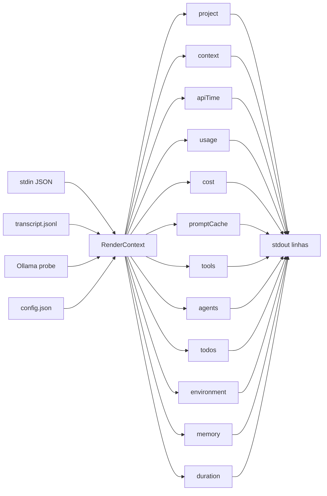

# Line Modules Reference

> **Diátaxis: Reference.** Catálogo dos 12 line renderers em `src/render/lines/`. Para cada um: o que produz, em que modo ativa, qual flag liga, quais campos do stdin/transcript consome.

Cada line module exporta uma função `render*(ctx: RenderContext): string | null`. Retornar `null` significa "pula esta linha". O orquestrador em `src/render/index.ts` chama os módulos na ordem definida por `config.elementOrder` e descarta `null`s.

Visão geral:



Convenção visual em todas as tabelas:

- **Modo**: `any` (todos os modos), `ollama` (apenas Ollama), `anthropic` (apenas Anthropic).
- **Flag**: o campo de `display.*` que liga ou desliga o módulo. `(default on)` ou `(default off)` indica o estado padrão.

---

## 1. `project`

**File**: `src/render/lines/project.ts:renderProject`
**Modo**: `any`
**Flags**: `showModel`, `showEffortLevel`, `gitStatus.enabled`, `gitStatus.showDirty`, `gitStatus.showAheadBehind`
**Sempre emite algo** (não retorna `null`) — é a "linha-âncora" do statusline.

### O que renderiza

```
[modelo] caminho │ git:(branch ↑3 ↓1) │ effort:max
```

Quatro blocos opcionais separados pelo glyph `sep` (` │ ` em unicode, ` | ` em ASCII):

| Bloco | Vem de | Liga com |
|---|---|---|
| Model badge `[name]` | `stdin.model.display_name` ou `stdin.model.id` | `display.showModel` |
| Project path | Prefere `basename(stdin.workspace.project_dir)` (estável entre worktrees); senão `stdin.workspace.current_dir`/`stdin.cwd` slice por `pathLevels` | sempre on se houver dir |
| Git block `git:(...)` | `git status -b` cacheado em `src/git.ts` | `gitStatus.enabled` |
| Effort `effort:LEVEL` | `stdin.effort.level` resolvido por `src/effort.ts` | `display.showEffortLevel` |

### Detalhe — `:cloud` parameter size

Em modo `ollama`, se `stdin.model.id` casa com algum `probe.cloudModels[].name`, o badge anexa o tamanho do parâmetro:

```
[gemma4:31b-cloud ⚡ 31b]
```

Vem de `cloudInfo.details.parameter_size` (`project.ts:25-26`).

### Detalhe — ahead/behind colorido

Quando `showAheadBehind: true` e o branch diverge:
- `pushCriticalThreshold > 0` e `ahead ≥ critical` → `↑N` em `colors.critical`.
- `pushWarningThreshold > 0` e `ahead ≥ warning` → `↑N` em `colors.warning`.
- Senão `↑N` em `colors.gitBranch`.

`↓N` é sempre `colors.gitBranch` (downstream commits não causam alarme).

### Exemplo

```
[claude-sonnet-4-6] ohud │ git:(main *↑2) │ effort:max
```

---

## 2. `context`

**File**: `src/render/lines/context.ts:renderContext`
**Modo**: `any`
**Flag**: `showContextBar` (default on)
**Retorna `null` quando**: flag off, ou `context_window.used_percentage` ausente/não-finito.

### O que renderiza

```
Context ████░░░░░░ 43%
```

Largura fixa: `BAR_WIDTH = 10` caracteres. Glyphs `barFull`/`barEmpty` (`█`/`░` em unicode, `#`/`.` em ASCII).

### Cor por threshold (`context.ts:14-17`)

| `used_percentage` | Cor |
|---|---|
| < 70 | `colors.context` (default `green`) |
| 70 – 84 | `colors.warning` (default `yellow`) |
| ≥ 85 | `colors.critical` (default `red`) |

### Formato do número (`contextValue` config)

| Setting | Saída |
|---|---|
| `"percent"` (default) | `43%` |
| `"tokens"` | `84k/200k` |
| `"remaining"` | `57%` |
| `"both"` | `43% (84k/200k)` |

Tokens vêm de `total_input_tokens / context_window_size`. Divide por 1000 e arredonda.

### Stdin consumido

| Campo | Uso |
|---|---|
| `context_window.used_percentage` | barra + número padrão |
| `context_window.context_window_size` | denominador em modos `tokens`/`both` |
| `context_window.total_input_tokens` | numerador em modos `tokens`/`both` |

---

## 3. `apiTime`

**File**: `src/render/lines/api-time.ts:renderApiTime`
**Modo**: `ollama` apenas (`ctx.mode !== "ollama" → null`)
**Flag**: `showApiTime` (default on)
**Retorna `null` quando**: modo Anthropic, flag off, ou `total_api_duration_ms` ≤ 0.

### O que renderiza

```
API ⏱ 1m 24s
```

Formato `formatDuration(ms)`:
- `< 60s` → `Xs`
- `< 1h` → `Xm Ys`
- `≥ 1h` → `Xh Ym Zs`

### Por que só Ollama?

Em modo Anthropic, o sinal de "esforço" da sessão é `usage` (5h/7d windows) e `cost`. `total_api_duration_ms` ainda é populado, mas mostrá-lo em paralelo a Usage/Cost cria redundância. A regra é: **uma linha por sinal-chave por modo**.

### Stdin consumido

| Campo | Uso |
|---|---|
| `cost.total_api_duration_ms` | duração em ms (única fonte) |

---

## 4. `usage`

**File**: `src/render/lines/usage.ts:renderUsage`
**Modo**: `anthropic` apenas
**Flag**: `showUsage` (default on)
**Retorna `null` quando**: modo Ollama, flag off, ou `usageData` é `null` (sem rate limits no stdin nem em `externalUsagePath`).

### O que renderiza

Forma expandida (default):

```
Usage ████░░░░░░ 25% (5h) resets in ~2h | █████████░ 91% (7d) resets in ~3d
```

Forma compacta (`usageBarEnabled: false` ou `usageCompact: true`):

```
Usage 5h: 25% resets in ~2h | 7d: 91% resets in ~3d
```

### Quando 7d aparece

Apenas se `sevenDay >= display.sevenDayThreshold` (default 80). Mantém a linha curta no uso normal, escala quando importa.

### Cor por window pct

| % | Cor |
|---|---|
| < 60 | `colors.usage` (default `brightBlue`) |
| 60 – 84 | `colors.usageWarning` (default `brightMagenta`) |
| ≥ 85 | `colors.critical` (default `red`) |

`usageWarning` é distinta de `warning` para que usuários possam mapear "saturação de window" separadamente do "context >70%".

### Reset label (`showResetLabel: true`)

Formato controlado por `timeFormat`:

| Setting | Saída |
|---|---|
| `"relative"` | `resets in ~2h` |
| `"absolute"` | `resets at 14:30` |
| `"both"` | `resets in ~2h (14:30)` |

`resets_at` é epoch em **segundos** (não ms). `src/usage.ts` faz a conversão.

### Stdin consumido

| Campo | Uso |
|---|---|
| `rate_limits.five_hour.used_percentage` | window 5h |
| `rate_limits.five_hour.resets_at` | label de reset |
| `rate_limits.seven_day.used_percentage` | window 7d (gated por threshold) |
| `rate_limits.seven_day.resets_at` | label de reset |

Fallback: `display.externalUsagePath` aponta para um JSON snapshot, lido por `src/usage.ts:loadExternalUsage`. Útil para Anthropic users que não recebem rate-limits no stdin.

---

## 5. `cost`

**File**: `src/render/lines/cost.ts:renderCost`
**Modo**: `anthropic` apenas
**Flag**: `showCost` (default off — auto-display only on extra-usage)
**Retorna `null` quando**: modo Ollama, `costData` é `null`, ou — com `showCost: false` — quando `costData.source !== "native"` ou `costData.totalUsd <= 0`.

### Gating (auto vs opt-in)

| `showCost` | `costData` | renderiza? |
|---|---|---|
| `true` (opt-in) | qualquer valor presente | sim (native ou estimate) |
| `false` / default | `source: "native"` e `totalUsd > 0` | sim — sinal de **extra-usage** detectado |
| `false` / default | `source: "estimate"` | não — estimates só com opt-in |
| `false` / default | `totalUsd === 0` ou `null` | não |

A intenção: usuários em planos pagos dentro do limite não devem ver `Cost $0.00` toda tick. Só mostramos automaticamente quando Claude Code reporta um `cost.total_cost_usd > 0` nativo — o que sinaliza cobrança real fora do plano (extra-usage). Estimates calculadas localmente a partir de tokens só aparecem se o usuário fizer opt-in explícito via `showCost: true` (e.g. preset "Full").

### O que renderiza

```
Cost $0.42       ← cost.total_cost_usd presente e > 0 (source: "native")
Cost $0.38 (est) ← estimado de tokens (source: "estimate", requer showCost: true)
```

`(est)` aparece dim quando ohud tem que estimar — ou seja, quando `cost.total_cost_usd` está ausente do stdin e `src/cost.ts:estimateCost` calculou a partir de `current_usage.*`.

### Por que só Anthropic?

Ollama é local: o custo monetário direto é zero. Mostrar `Cost $0.00` toda tick é ruído.

### Stdin consumido

| Campo | Uso |
|---|---|
| `cost.total_cost_usd` | valor nativo (source `"native"`) |
| `context_window.current_usage.input_tokens` | input tokens para estimativa |
| `context_window.current_usage.output_tokens` | output tokens |
| `context_window.current_usage.cache_creation_input_tokens` | cache write |
| `context_window.current_usage.cache_read_input_tokens` | cache read |

---

## 6. `promptCache`

**File**: `src/render/lines/prompt-cache.ts:renderPromptCache`
**Modo**: `anthropic` apenas
**Flag**: `showPromptCache` (default off)
**Retorna `null` quando**: modo Ollama, flag off, ou `lastAssistantResponseAt` ausente, ou TTL já expirou.

### O que renderiza

```
cache 3m12s
```

Indica quanto resta do prompt-cache TTL antes que blocos `cache_control: ephemeral` expirem na próxima request. Vem de `promptCacheRemainingMs(lastAssistantResponseAt, ttlSeconds)` em `src/prompt-cache.ts`.

`promptCacheTtlSeconds` (default `300` = 5 min) deve casar o TTL real do prompt cache da Anthropic. Se mudar, ajuste em config.

### Por que importa

Se você está compondo a próxima mensagem perto do limite, vale esperar — ou re-enviar antes de expirar. Esta linha avisa em tempo real.

### Stdin/transcript consumido

| Campo | Uso |
|---|---|
| `transcript.lastAssistantResponseAt` | extraído por `src/transcript.ts` da última mensagem assistant |

---

## 7. `tools`

**File**: `src/render/lines/tools.ts:renderTools`
**Modo**: `any`
**Flag**: `showTools` (default off)
**Retorna `null` quando**: flag off, ou `transcript.tools` vazio.

### O que renderiza

```
◐ Read: index.ts | ✓ Edit ×3 | ✓ Bash ×2
```

Dois grupos:

1. **Running** (`status === "running"`): mostra cada tool individualmente com seu target (`basename` do path) — saber *qual* arquivo está sendo lido importa.
2. **Completed** (`status === "completed"`): tally por nome com `×N`. Detalhes individuais não importam — só a frequência.

### Stdin/transcript consumido

| Campo | Uso |
|---|---|
| `transcript.tools[]` | extraído pelo `src/transcript.ts` parseando `tool_use` blocks |

`ToolEntry`: `{ name, target?, status: "running" | "completed" }`.

---

## 8. `agents`

**File**: `src/render/lines/agents.ts:renderAgents`
**Modo**: `any`
**Flag**: `showAgents` (default off)
**Retorna `null` quando**: flag off, ou `transcript.agents` vazio.

### O que renderiza

```
◐ general-purpose [claude-sonnet-4-6]: search for cache references (1m 23s) | ✓ Explore: …
```

Por agent: glyph (`running`/`done`) + tipo + model tag opcional + descrição opcional + elapsed (apenas se ainda running).

### Por que mostrar agents?

Sub-agents podem rodar minutos. Saber qual está ativo, quanto tempo levou, é o sinal mais útil em workflows multi-agente.

### Stdin/transcript consumido

| Campo | Uso |
|---|---|
| `transcript.agents[]` | parsed de `Task` tool_use blocks pelo `src/transcript.ts` |

`AgentEntry`: `{ type, model?, description?, status, startTime, endTime? }`.

---

## 9. `todos`

**File**: `src/render/lines/todos.ts:renderTodos`
**Modo**: `any`
**Flag**: `showTodos` (default off)
**Retorna `null` quando**: flag off, ou `transcript.todos` vazio.

### O que renderiza

Com in_progress:
```
▸ implementar split-TTL cache (3/9)
```

Sem in_progress (todos pending ou completed):
```
○ no active todo (5/9)
```

`(N/M)` = `completed/total`.

### Stdin/transcript consumido

| Campo | Uso |
|---|---|
| `transcript.todos[]` | parsed de `TodoWrite` tool_use blocks |

`TodoEntry`: `{ content, status: "pending" | "in_progress" | "completed" }`.

---

## 10. `environment`

**File**: `src/render/lines/environment.ts:renderEnvironment`
**Modo**: `any`
**Flag**: `showConfigCounts` (default off)
**Retorna `null` quando**: flag off, ou sem `current_dir`/`cwd`.

### O que renderiza

```
3 CLAUDE.md | 7 rules | 4 MCPs | 12 hooks
```

Quatro contagens, sempre na mesma ordem:

| Contador | Como conta |
|---|---|
| `CLAUDE.md` | walks up de `current_dir` até `home`, conta `CLAUDE.md` em cada nível |
| `rules` | linhas marcadas com `-` ou `*` em `<cwd>/.claude/rules.md` |
| `MCPs` | chaves de `~/.claude/settings.json:mcpServers` |
| `hooks` | total de entries em `~/.claude/settings.json:hooks` (todos os events) |

### Por que existe

Útil em projetos com configuração espalhada. "Eu definitivamente tinha 3 CLAUDE.md aqui" — quando o número muda, você notou.

### Custo

Lê 2-5 arquivos por tick. Ainda dentro do budget (~3-8 ms), mas é o módulo mais I/O-intensivo. Por isso `default off`.

---

## 11. `memory`

**File**: `src/render/lines/memory.ts:renderMemory`
**Modo**: `any`
**Flag**: `showMemoryUsage` (default off)
**Retorna `null` quando**: flag off, **ou `lineLayout !== "expanded"`**, ou `memoryInfo` ausente.

### O que renderiza

```
RAM ███████░░░ 71% (11.4 GB / 16.0 GB)
```

`memoryInfo` vem de `src/memory.ts:readSystemMemory` que usa `os.totalmem()` / `os.freemem()` em todas as plataformas.

### Detalhe — `lineLayout === "compact"`

Único módulo que respeita `lineLayout` em v0.1. Quando compact, retorna `null` para liberar espaço. Outros módulos ignoram a config — v0.2 vai padronizar.

---

## 12. `duration`

**File**: `src/render/lines/duration.ts:renderDuration`
**Modo**: `any`
**Flags**: `showDuration` ou `showSpeed` (qualquer das duas liga; ambas default off)
**Retorna `null` quando**: ambas flags off, ou nenhum dos componentes produz valor.

### O que renderiza

Apenas `showDuration`:
```
⏱ 5m
```

Apenas `showSpeed` (estado atual: `null` sempre — ver abaixo):
```
out: 12.3 tok/s
```

Ambos:
```
⏱ 5m | out: 12.3 tok/s
```

### Detalhe importante — `showSpeed` é inerte em v0.1

`computeTokensPerSecond` em `duration.ts:32-34` retorna `null` incondicionalmente:

```ts
function computeTokensPerSecond(_ctx: RenderContext): number | null {
  return null;
}
```

A intenção original era usar timing fields do Ollama daemon para tokens/segundo, mas esses fields não propagam pelo stdin. v0.2 pretende ler diretamente do daemon. Por enquanto, `showSpeed: true` não desenha nada. `/ohud doctor` ainda anota a flag como `consumed` porque o renderer existe — esse é um *false positive* conhecido, registrado no plano.

### Stdin consumido

| Campo | Uso |
|---|---|
| `cost.total_duration_ms` | wall-clock total da sessão |

---

## Como o renderer principal compõe as linhas

`src/render/index.ts` percorre `config.elementOrder`, chama cada `render*`, descarta `null`s. Tem três comportamentos especiais:

### 1. Merge groups (parcial em v0.1)

`(context, apiTime)` e `(context, usage)` são *hardcoded* como pares mergeable. Quando ambos retornam strings, ohud combina-os numa única linha (separador `│`).

```
Context ████░░░░░░ 43% │ API ⏱ 1m 24s
```

`mergeGroups` config existe mas não é genérica ainda — ver [explanation/design-decisions.md](../explanation/design-decisions.md#dead-config-triage-delete-vs-implement) para o trade-off.

### 2. Fallback de linha mínima

Se **todos** os 12 renderers retornam `null`, ohud emite literal `"ohud"` em vez de string vazia. Statusline em branco é indistinguível de "ohud quebrou" — uma única palavra confirma "ohud rodou, só não tinha nada a mostrar".

### 3. Truncamento por largura

Cada linha passa por `truncateLine(line, maxWidth)` em `src/render/width.ts`. `maxWidth` resolve em ordem: `config.maxWidth` → `process.env.COLUMNS` → `process.stdout.columns` → 120.

`wcwidth` próprio cobre os glyphs ohud usa + ranges genéricos para emoji e CJK. Linhas mais longas que `maxWidth` ganham `…` no fim.

---

## Resumo em uma tabela

| # | Módulo | Modo | Flag default | Sempre emite? | Fonte primária |
|---|---|---|---|---|---|
| 1 | project | any | on | ✅ (anchor) | stdin.model + workspace + git |
| 2 | context | any | on | ❌ | `context_window.used_percentage` |
| 3 | apiTime | ollama | on | ❌ | `cost.total_api_duration_ms` |
| 4 | usage | anthropic | on | ❌ | `rate_limits.*` |
| 5 | cost | anthropic | off (auto on extra-usage) | ❌ | `cost.total_cost_usd` ou estimativa |
| 6 | promptCache | anthropic | off | ❌ | `transcript.lastAssistantResponseAt` |
| 7 | tools | any | off | ❌ | `transcript.tools[]` |
| 8 | agents | any | off | ❌ | `transcript.agents[]` |
| 9 | todos | any | off | ❌ | `transcript.todos[]` |
| 10 | environment | any | off | ❌ | filesystem walk + settings.json |
| 11 | memory | any | off | ❌ | `os.totalmem/freemem` |
| 12 | duration | any | off | ❌ | `cost.total_duration_ms` |

---

## See also

- [reference/config-schema.md](config-schema.md) — toda flag listada aqui.
- [reference/stdin-contract.md](stdin-contract.md) — o JSON shape que alimenta os módulos.
- [explanation/architecture.md](../explanation/architecture.md#failure-modes-and-observability) — como `null` × erro × silêncio diferem.
- [how-to/add-a-new-line-module.md](../how-to/add-a-new-line-module.md) — receita para escrever um 13º módulo.
