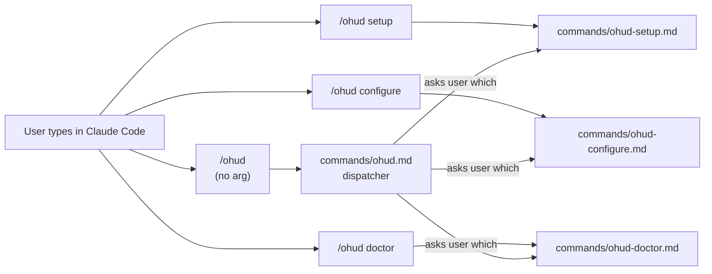
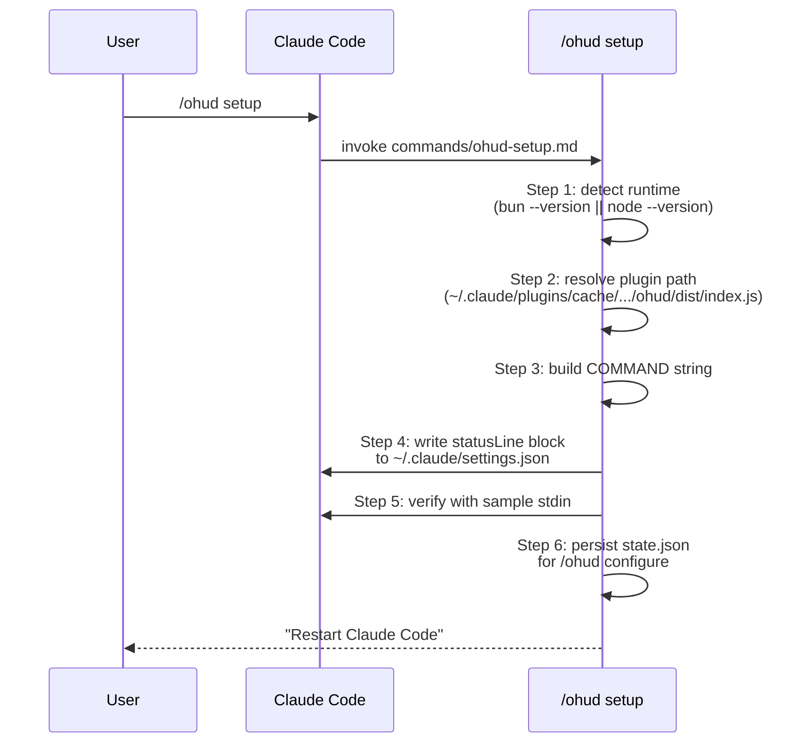
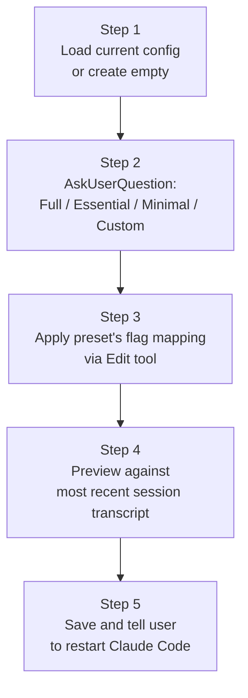

# Slash Commands Reference

> **Diátaxis: Reference.** Authoritative description of every `/ohud` subcommand. For step-by-step usage, see [tutorials/getting-started.md](../tutorials/getting-started.md) or [how-to/](../how-to/).

ohud registers four slash commands via `.claude-plugin/plugin.json`:



---

## `/ohud` (no argument)

**File**: `commands/ohud.md`

Dispatcher. With no argument, shows an `AskUserQuestion` prompt with three choices: Setup, Configure, Doctor. Routes the user to the chosen subcommand.

If invoked with an unknown argument (e.g., `/ohud foo`), responds:

> Unknown subcommand. Use `/ohud setup`, `/ohud configure`, or `/ohud doctor`.

**When to use**: when you're not sure which subcommand you need. Otherwise call the specific subcommand directly.

---

## `/ohud setup` (optional)

**File**: `commands/ohud-setup.md`

**Status**: optional in v0.1.

ohud activates automatically via `plugin.json:statusLine` after `/plugin install ohud`. This command exists for users who want to **wrap the runtime** — e.g., for development with hot-reload:

```bash
"command": "bun --hot $PLUGIN_PATH"
```

### What it does



### Side effects

- Writes/merges `statusLine` block in `~/.claude/settings.json`.
- Writes `~/.claude/plugins/ohud/state.json` with detected runtime, plugin path, command, and timestamp. `/ohud configure` reads this for its preview.

### When to use

- Development: wrap with `bun --hot` for live reload.
- Custom runtime: use a non-default Node version or shim wrapper.
- Re-detect after manual cache directory move.

### When NOT to use

- Fresh install. The manifest declaration is the right path. No setup needed.

---

## `/ohud configure`

**File**: `commands/ohud-configure.md`

**Purpose**: Walk the user through preset selection and write `~/.claude/plugins/ohud/config.json`.

### Steps



### Presets (encoded in `commands/ohud-configure.md`)

**Full** — everything Pilha A enables:
```json
{
  "showCost": true, "showPromptCache": true, "showTools": true,
  "showAgents": true, "showTodos": true, "showDuration": true,
  "showSpeed": true, "showMemoryUsage": true, "showEffortLevel": true,
  "gitStatus.showAheadBehind": true,
  "lineLayout": "expanded"
}
```

**Essential**:
```json
{
  "showTools": true, "showTodos": true, "showCost": false,
  "showAgents": false, "showMemoryUsage": false, "showEffortLevel": true,
  "gitStatus.showAheadBehind": true,
  "lineLayout": "expanded"
}
```

**Minimal** — all `show*` flags false except:
```json
{
  "showModel": true, "showContextBar": true, "showApiTime": true,
  "showUsage": true, "showEffortLevel": true,
  "gitStatus.showAheadBehind": false,
  "lineLayout": "expanded"
}
```

**Custom**: keeps current config, asks per-flag follow-ups.

### Preserved fields

The wizard never overwrites: `colors.*`, `pathLevels`, `maxWidth`, `display.timeFormat`, `display.promptCacheTtlSeconds`, `display.sevenDayThreshold`, `display.externalUsagePath`, `ollama.host`. These stay user-managed; configure only touches the show-flags.

### Side effects

- Writes/edits `~/.claude/plugins/ohud/config.json`.
- The Step 4 preview pipes a real recent session's stdin to `dist/index.js` and shows the rendered output. Reads from `state.json` written by `/ohud setup` (or falls back to `$CLAUDE_PLUGIN_ROOT`).

### When to use

- After install, to pick a preset.
- When you want to enable/disable specific lines.
- Before reporting that "nothing's showing up" — make sure the relevant flag is on.

---

## `/ohud doctor`

**File**: `commands/ohud-doctor.md`

**Purpose**: Diagnose. The single highest-leverage troubleshooting tool in ohud.

### What it prints

Six sections, in order:

| Section | Source | What it tells you |
|---|---|---|
| `ohud version:` | `package.json:version` | Which version you have. |
| `runtime:` | `process.version` + `process.argv0` | Which Node/Bun is actually executing. |
| `resolved bundle:` | `${CLAUDE_PLUGIN_ROOT}/dist/index.js` + `existsSync` | Where the bundle is + does it exist. |
| `probe:` (live, cache bypassed) | Fresh `probeOllama({daemonTtlSeconds: 0, cloudModelsTtlSeconds: 0, ...})` | Daemon up? Which `:cloud` models? |
| `mode:` | `resolveMode(stdin, probe)` | Inferred mode. |
| `active config flags (consumed?):` | All `display.*` and `gitStatus.*` annotated `consumed` or `DEAD FLAG` | Which user-toggled flags actually have effect. |
| `last errors` (if log exists) | Tail of `~/.claude/plugins/ohud/last-errors.log` | Last 5 errors. |

### Sample output

```
ohud version: 0.1.0
runtime: v22.22.2 (process.argv0=node)
resolved bundle: /Users/me/.claude/plugins/cache/.../ohud/dist/index.js (exists: yes)
probe: live (cache bypassed) — daemonOk: yes
cloud models: gemma4:31b-cloud, glm-4.7:cloud, kimi-k2.6:cloud
mode: ollama-capable

active config flags (consumed?):
  display.lineLayout: "expanded" (consumed)
  display.showModel: true (consumed)
  display.showCost: false (consumed)
  display.showOutputStyle: false (DEAD FLAG)
  ...
  gitStatus.enabled: true (consumed)
  gitStatus.branchOverflow: "truncate" (DEAD FLAG)
```

### Cache bypass

`runDoctor` calls `probeOllama` with `daemonTtlSeconds: 0` AND `cloudModelsTtlSeconds: 0` — both expire immediately, forcing a live re-fetch. The doctor's purpose is to show **current** state, not whatever the regular probe last cached.

### When to use

- Statusline blank or wrong — first thing to run.
- After config change, to see which flags ohud actually reads.
- When filing a bug report: paste doctor output.
- When auditing a v0.2 upgrade — `DEAD FLAG` annotations should diminish with time.

### How to invoke directly (without slash)

```bash
node "$CLAUDE_PLUGIN_ROOT/dist/index.js" --doctor
```

Or:

```bash
bun "$CLAUDE_PLUGIN_ROOT/dist/index.js" --doctor
```

`--doctor` is checked at the top of `main()` in `src/index.ts` before any stdin reading. So it doesn't block waiting for piped input.

---

## See also

- [tutorials/getting-started.md](../tutorials/getting-started.md) — guided first run.
- [how-to/diagnose-blank-statusline.md](../how-to/diagnose-blank-statusline.md) — when to reach for doctor.
- [reference/config-schema.md](config-schema.md) — what configure writes.
