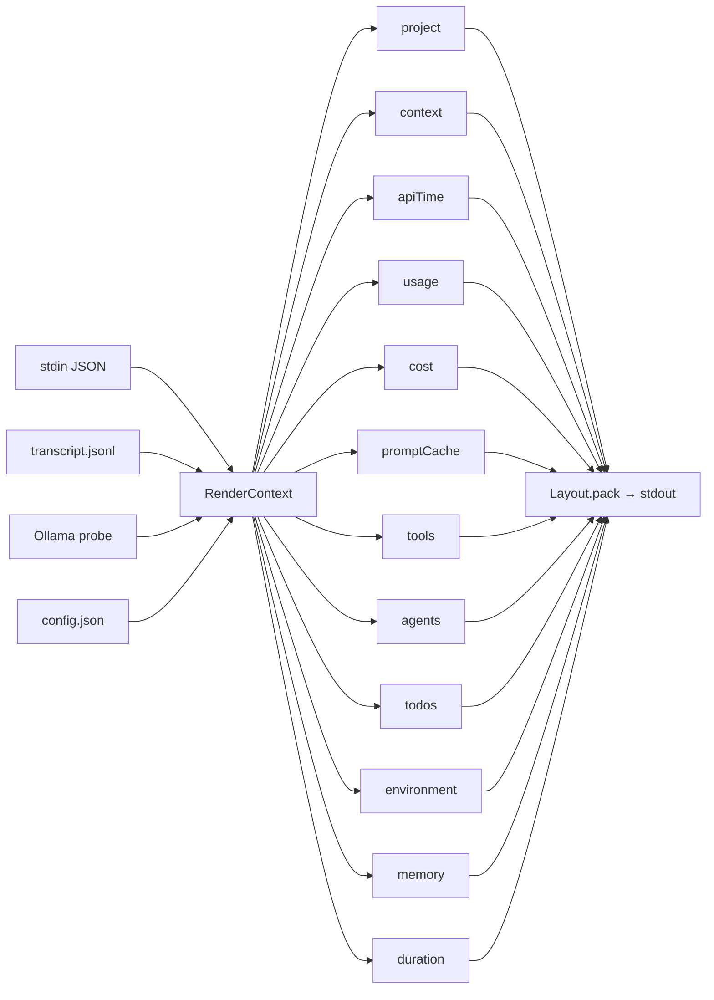

# Widgets Reference

> **Diátaxis: Reference.** Catalog of all 12 widgets in `src/render/widgets/`. For each: id, group, priority, minWidth, Row render behavior, and Hush render behavior. For a conceptual explanation of the Widget+Layout architecture, see [explanation/architecture.md](../explanation/architecture.md#layout-strategies).

Each widget implements the `Widget` interface (`src/render/widget.ts`). It produces one cell per tick — or null to skip. The **RowLayout** calls `widget.render(ctx)` and emits full ANSI output; the **HushLayout** calls `widget.renderHush(ctx)` and emits a plain-text `HushCell` that the layout colors and arranges.

Overview:



Convention:

- **Mode**: `any` (all modes), `ollama` (Ollama mode only), `anthropic` (Anthropic mode only).
- **Flag**: the `display.*` field that toggles the widget. `(default on)` or `(default off)` notes the default.
- **Hush**: behavior in HushLayout. `null (hidden)` means the widget always returns null in Hush mode.

---

## 1. `project`

| Property | Value |
|----------|-------|
| **id** | `project` |
| **group** | `header` |
| **priority** | `100` |
| **minWidth** | `20` |
| **File** | `src/render/widgets/project.ts` |
| **Mode** | `any` |
| **Flags** | `showModel`, `showEffortLevel`, `gitStatus.enabled`, `gitStatus.showDirty`, `gitStatus.showAheadBehind` |
| **Always emits** | Yes — anchor widget, never returns null |

### Row render

```
[model] path │ git:(branch ↑3 ↓1) │ effort:max
```

Four optional blocks separated by ` │ ` (unicode) or ` | ` (ASCII):

| Block | Source | Toggle |
|-------|--------|--------|
| Model badge `[name]` | `stdin.model.display_name` or `stdin.model.id` | `display.showModel` |
| Project path | `basename(stdin.workspace.project_dir)` preferred; falls back to `current_dir` sliced by `pathLevels` | always on if dir present |
| Git block `git:(...)` | `git status -b` via `src/git.ts` | `gitStatus.enabled` |
| Effort `effort:LEVEL` | `stdin.effort.level` via `src/effort.ts` | `display.showEffortLevel` |

### Hush render

Returns an **array** of up to 3 sub-cells:

| Sub-cell | Text | Attention | baseColor | Link |
|----------|------|-----------|-----------|------|
| Project name | `basename(project_dir)` | `normal` | `cyan` | `file://${project_dir}` |
| Branch | `branch` or `branch*` | `normal` (clean) / `warning` (dirty) | `green` (clean) / none | Remote HTTPS URL if detectable |
| Model label | condensed id e.g. `opus-4.7` | `normal` | `blue` | `https://docs.anthropic.com/.../models#${anchor}` |

Branch sub-cell is omitted when `gitStatus.enabled: false` or `gitStatus` is null. Model sub-cell is omitted when `showModel: false`.

---

## 2. `context`

| Property | Value |
|----------|-------|
| **id** | `context` |
| **group** | `metrics` |
| **priority** | `90` |
| **minWidth** | `22` |
| **File** | `src/render/widgets/context.ts` |
| **Mode** | `any` |
| **Flag** | `showContextBar` (default on) |
| **Returns null when** | flag off, or `context_window.used_percentage` absent or non-finite |

### Row render

```
Context ████░░░░░░ 43%
```

Fixed `BAR_WIDTH = 10` chars. Color by threshold:

| `used_percentage` | Color |
|-------------------|-------|
| < `warningThreshold` (60) | `colors.context` (default `green`) |
| ≥ 60 and < `criticalThreshold` (75) | `colors.warning` (default `yellow`) |
| ≥ 75 | `colors.critical` (default `red`) |

### Hush render

Returns a single cell: `{ text: "43%", attention }`. No bar characters. Attention driven by `display.hush.thresholds.warning` / `.danger` (falls through to global `warningThreshold` / `criticalThreshold`):

| `used_percentage` | Attention |
|-------------------|-----------|
| < warning threshold (60) | `muted` (dimmed) |
| ≥ warning and < danger threshold (75) | `warning` (yellow) |
| ≥ danger threshold (75) | `danger` (red) |

---

## 3. `apiTime`

| Property | Value |
|----------|-------|
| **id** | `apiTime` |
| **group** | `metrics` |
| **priority** | `80` |
| **minWidth** | `14` |
| **File** | `src/render/widgets/api-time.ts` |
| **Mode** | `ollama` only |
| **Flag** | `showApiTime` (default on) |
| **Returns null when** | Anthropic mode, flag off, or `total_api_duration_ms` ≤ 0 |

### Row render

```
API ⏱ 1m 24s
```

Format: `< 60s → Xs`, `< 1h → Xm Ys`, `≥ 1h → Xh Ym Zs`.

### Hush render

| Value | Text | Attention |
|-------|------|-----------|
| < 100ms | e.g. `42ms` | `muted` |
| 100–499ms | e.g. `320ms` | `normal` |
| 500–1499ms | e.g. `842ms` | `warning` |
| ≥ 1500ms | e.g. `2.1s` | `danger` |

---

## 4. `usage`

| Property | Value |
|----------|-------|
| **id** | `usage` |
| **group** | `metrics` |
| **priority** | `80` |
| **minWidth** | `22` |
| **File** | `src/render/widgets/usage.ts` |
| **Mode** | `anthropic` only |
| **Flag** | `showUsage` (default on) |
| **Returns null when** | Ollama mode, flag off, or `usageData` is null |

### Row render

Expanded (default):
```
Usage ████░░░░░░ 25% (5h) resets in ~2h | █████████░ 91% (7d) resets in ~3d
```

Compact (`usageBarEnabled: false` or `usageCompact: true`):
```
Usage 5h: 25% resets in ~2h | 7d: 91% resets in ~3d
```

7d window appears only when `sevenDay >= display.sevenDayThreshold` (default 80).

### Hush render

Returns a single cell with plain-text format `5h 25%` (no bars). Suppressed when both 5h and 7d are below 50%. Attention follows same thresholds as Row, but uses unified `warning` / `danger`.

---

## 5. `cost`

| Property | Value |
|----------|-------|
| **id** | `cost` |
| **group** | `metrics` |
| **priority** | `70` |
| **minWidth** | `14` |
| **File** | `src/render/widgets/cost.ts` |
| **Mode** | `anthropic` only |
| **Flag** | `showCost` (default off; auto-shows on native extra-usage) |
| **Returns null when** | Ollama mode, `costData` null, or estimate-only without `showCost: true` |

### Row render

```
Cost $0.42         ← native cost.total_cost_usd > 0
Cost $0.38 (est)   ← estimated from tokens (requires showCost: true)
```

### Hush render

**Always returns null.** Cost is permanently hidden in Hush mode. It remains visible in Row mode. See [hush-philosophy.md](../explanation/hush-philosophy.md#what-hush-omits).

---

## 6. `promptCache`

| Property | Value |
|----------|-------|
| **id** | `promptCache` |
| **group** | `metrics` |
| **priority** | `60` |
| **minWidth** | `14` |
| **File** | `src/render/widgets/prompt-cache.ts` |
| **Mode** | `anthropic` only |
| **Flag** | `showPromptCache` (default off) |
| **Returns null when** | Ollama mode, flag off, `lastAssistantResponseAt` absent, or TTL expired |

### Row render

```
cache 3m12s
```

Shows remaining time before prompt-cache blocks expire. Default TTL is 300s (5 min) — set `display.promptCacheTtlSeconds` to match the Anthropic API TTL if it changes.

### Hush render

Returns `{ text: "cache 4m", attention: "muted", baseColor: "cyan" }` — rendered as dim cyan. Suppressed when remaining TTL < 60s.

---

## 7. `memory`

| Property | Value |
|----------|-------|
| **id** | `memory` |
| **group** | `metrics` |
| **priority** | `50` |
| **minWidth** | `18` |
| **File** | `src/render/widgets/memory.ts` |
| **Mode** | `any` |
| **Flag** | `showMemoryUsage` (default off) |
| **Returns null when** | flag off, `lineLayout !== "expanded"`, or `memoryInfo` absent |

### Row render

```
RAM ███████░░░ 71% (11.4 GB / 16.0 GB)
```

Color by threshold (same unified scale as context/usage).

### Hush render

**Always returns null.** Memory is permanently hidden in Hush mode. It remains visible in Row mode. See [hush-philosophy.md](../explanation/hush-philosophy.md#what-hush-omits).

---

## 8. `duration`

| Property | Value |
|----------|-------|
| **id** | `duration` |
| **group** | `metrics` |
| **priority** | `40` |
| **minWidth** | `12` |
| **File** | `src/render/widgets/duration.ts` |
| **Mode** | `any` |
| **Flags** | `showDuration` or `showSpeed` (either enables; both default off) |
| **Returns null when** | both flags off, or no duration data |

### Row render

```
⏱ 5m
```

Note: `showSpeed` is currently inert — `computeTokensPerSecond` always returns null in v0.1. The flag exists; the field does not yet propagate.

### Hush render

Returns `{ text: "2h", attention: "muted" }` (short sessions are dimmed). Attention escalates at 4h/8h/12h boundaries:

| Duration | Attention |
|----------|-----------|
| < 4h | `muted` |
| 4h–7h59m | `normal` |
| 8h–11h59m | `warning` |
| ≥ 12h | `danger` |

---

## 9. `tools`

| Property | Value |
|----------|-------|
| **id** | `tools` |
| **group** | `activity` |
| **priority** | `90` |
| **minWidth** | `16` |
| **File** | `src/render/widgets/tools.ts` |
| **Mode** | `any` |
| **Flag** | `showTools` (default off) |
| **Returns null when** | flag off, or transcript.tools empty |

### Row render

```
◐ Read: index.ts | ◐ Edit ×3: foo.ts | ✓ Edit ×3 | ✓ Bash ×2
```

Two groups:
1. **Running** (`status === "running"`): deduped by `(name, target)`. Same name + same target → `Name ×N: target`. Same name + different targets → `Name ×N` (target dropped — ambiguous).
2. **Completed** (`status === "completed"`): tally by name with `×N`.

### Hush render

Returns an **array** of HushCells — one per unique running group, one per unique done group:

| Entry type | text | attention | baseColor | animate |
|------------|------|-----------|-----------|---------|
| Running tool | `Edit ×4` | `normal` | `cyan` | `"spinner"` |
| Done tool | `✓ Read ×2` | `muted` | `green` | `null` |

HushLayout prepends the animated spinner glyph for `animate === "spinner"` cells.

---

## 10. `agents`

| Property | Value |
|----------|-------|
| **id** | `agents` |
| **group** | `activity` |
| **priority** | `85` |
| **minWidth** | `16` |
| **File** | `src/render/widgets/agents.ts` |
| **Mode** | `any` |
| **Flag** | `showAgents` (default off) |
| **Returns null when** | flag off, or transcript.agents empty |

### Row render

Single running agent:
```
◐ general-purpose [claude-sonnet-4-6]: search for cache references (1m 23s)
✓ explore ×2 | ✓ review
```

Multiple running agents — one line per running agent, completed summary trailing:
```
◐ explore [haiku]: A (12s)
◐ review [sonnet]: B (8s)
✓ explore ×2
```

The renderer embeds `\n` for multi-line output; the orchestrator splits before truncation.

### Hush render

Returns an **array** of HushCells — same pattern as tools but for agent entries. Running agents get `animate: "spinner"`, completed agents get `attention: "muted", baseColor: "green"` and the `✓` prefix embedded in `text`.

---

## 11. `todos`

| Property | Value |
|----------|-------|
| **id** | `todos` |
| **group** | `activity` |
| **priority** | `70` |
| **minWidth** | `20` |
| **File** | `src/render/widgets/todos.ts` |
| **Mode** | `any` |
| **Flag** | `showTodos` (default off) |
| **Returns null when** | flag off, or transcript.todos empty |

### Row render

With `in_progress` todo:
```
▸ implement split-TTL cache (3/9)
```

No in-progress todo:
```
○ no active todo (5/9)
```

`(N/M)` = `completed/total`.

### Hush render

Returns a single cell: `{ text: "▸ todo content", attention: "warning" }`. Suppressed when no in-progress todo exists (null).

---

## 12. `environment`

| Property | Value |
|----------|-------|
| **id** | `environment` |
| **group** | `activity` |
| **priority** | `30` |
| **minWidth** | `14` |
| **File** | `src/render/widgets/environment.ts` |
| **Mode** | `any` |
| **Flag** | `showConfigCounts` (default off) |
| **Returns null when** | flag off, or no `current_dir`/`cwd` |

### Row render

```
3 CLAUDE.md | 7 rules | 4 MCPs | 12 hooks
```

Counts: `CLAUDE.md` files walking up from `current_dir` to home; `.claude/rules.md` bullet lines; `mcpServers` keys; `hooks` entries from `~/.claude/settings.json`.

### Hush render

**Always returns null.** Environment counts are low-priority ambient data; they do not fit Hush's "only what changed" focus.

---

## Summary table

| # | Widget id | group | priority | minWidth | Mode | Flag default | Hush behavior |
|---|-----------|-------|----------|----------|------|--------------|---------------|
| 1 | `project` | header | 100 | 20 | any | on | 3 sub-cells (name + branch + model) |
| 2 | `context` | metrics | 90 | 22 | any | on | `43%` text, threshold-driven attention |
| 3 | `apiTime` | metrics | 80 | 14 | ollama | on | time text, threshold-driven attention |
| 4 | `usage` | metrics | 80 | 22 | anthropic | on | `5h 25%` text, threshold-driven attention |
| 5 | `cost` | metrics | 70 | 14 | anthropic | off | **null (hidden)** |
| 6 | `promptCache` | metrics | 60 | 14 | anthropic | off | `cache 4m`, dim cyan |
| 7 | `memory` | metrics | 50 | 18 | any | off | **null (hidden)** |
| 8 | `duration` | metrics | 40 | 12 | any | off | session time, attention by duration |
| 9 | `tools` | activity | 90 | 16 | any | off | array: spinner cells for running, dim-green ✓ for done |
| 10 | `agents` | activity | 85 | 16 | any | off | array: same pattern as tools |
| 11 | `todos` | activity | 70 | 20 | any | off | `▸ todo` text when in-progress |
| 12 | `environment` | activity | 30 | 14 | any | off | **null (hidden)** |

---

## See also

- [reference/config-schema.md](config-schema.md) — every flag listed here.
- [reference/stdin-contract.md](stdin-contract.md) — the JSON shape that feeds the widgets.
- [explanation/hush-philosophy.md](../explanation/hush-philosophy.md) — why Hush hides cost, memory, and environment.
- [explanation/architecture.md](../explanation/architecture.md#layout-strategies) — Widget+Layout Strategy pattern.
- [how-to/customize-layout.md](../how-to/customize-layout.md) — add a new widget (13th entry).
